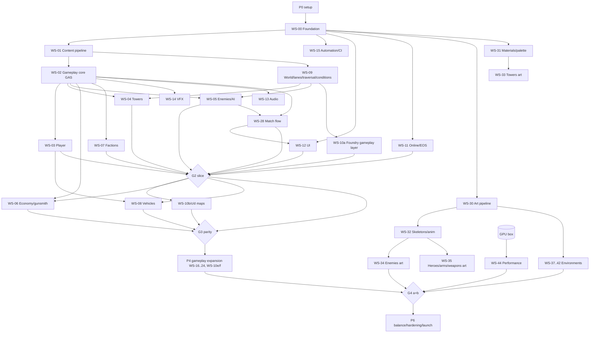

# Deep Field 3D → Unreal Engine 5.8: the full pre-launch programme, sequenced for parallel agent sessions

## 1. Context (why)

Deep Field 3D is a 1–4 player co-op FPS tower defense on Godot 4.7 + C# (v0.12.0). Every asset is a procedural graybox-grade three.js export; there is no audio; day/night/fog exist in the rules but are never rendered; the netcode trusts friends. The decision, taken in this conversation, is to **rebuild the game natively in Unreal Engine 5.8**, ship on the **Epic Games Store with Epic Online Services** as **Level 1 invite-only co-op** (player-hosted over EOS relay) with the seams for public matchmaking (L2) and server-owned progression (L3) kept open, and — before launch — **redesign every 3D model to Unreal fidelity, make the scenes graphically intensive, upgrade every existing system, add net-new mechanics, and make the world physical**.

The C# sim (`sim/Sim.Core`) stops running in the game. Its content tables are exported once as the starting numbers; its rules are the written spec. The harness is out of scope.

This plan is the single hand-off document for **many Claude Code sessions working simultaneously, one git worktree each, on the Windows GPU workstation** (ADR-0028; the programme started on an M1 Mac, now retired). Section 6 is the coordination protocol that keeps them aware of each other; Section 5 is the workstream registry they claim from; Appendices B–C carry the specs each workstream implements.

### 1.1 Decisions already made by the user
| Topic | Decision |
|---|---|
| Engine / architecture | UE 5.8, native (GAS, CMC, StateTree, Common UI, Niagara, MetaSounds); no C# at runtime; harness not a concern |
| Store / online / audience | EGS + EOS; Level 1 invite-only listen server over EOS P2P relay; L2/L3 designed for, not built |
| Art | Megascans/Fab for environments, props, surfaces; Claude Design (three.js generator, pushed harder) for hero pieces; **keep the palette semantics and design language, raise fidelity** |
| Platforms | Windows (macOS dropped 2026-09-25, ADR-0028) |
| Machines | The Windows GPU workstation (ADR-0028). The M1 Mac the programme started on is retired. |
| Horizon | No date — scope drives the date |
| Binary assets | Git LFS on GitHub |
| Sessions | Claude Code sessions on the GPU workstation, one worktree each |
| Terrain | **Real variable terrain on every map** — hills, valleys, real heights; flat only where it makes sense; enemies and vehicles terrain-aware; **maps change drastically (full layout redesigns)** — see ADR-0018 and Section 3.2 |
| Launch scope | **6 sectors** (foundry, switchyard, spire, toaster redesigned on terrain + Sluice + Crown new); **full proposed roster** (9 towers + barricade, 16 enemies, 5 elites, 1 boss, 11 ranged, 6 melee, 5 traps, 5 conditions, 3 difficulty tiers); **Versus post-launch**; **audio open-source/CC0 + generated only** |

### 1.2 Hard constraints
The programme was planned against an M1 Mac (8 GB RAM, ~16 GB free disk, no GPU); ADR-0016 recorded that and ADR-0028 retired it. The engine machine is now the Windows GPU workstation — setup is `unreal\deepfield.cmd setup` (`unreal/README.md`), what it measurably has is `unreal/Build/machines/windows-gpu.md`, and commissioning is `unreal/Build/windows-bringup.md`.

| Constraint | Consequence |
|---|---|
| **UE 5.8.2 launcher build** (`EngineAssociation: "5.8"`) with `OnlineServicesEOS`, `OnlineSubsystemEOS`, `EOSShared`, `SocketSubsystemEOS`, `CommonUI`, `GameplayAbilities`, `GameplayStateTree`, `ChaosVehicles` present | **No dedicated-server target** (source build only) — fine for L1; the L2 seam is an interface. Every machine stays on exactly 5.8.2. |
| The render, perf and Windows lanes have never produced a result | They stay "unverified" in the ledger until the box has measured them (ADR-0023). |
| The Claude-Design→Unreal converter lane (WS-30) runs headless Blender | Blender is installed on the box when that lane is built. |
| Existing `docs/design/` three.js sources + `tools/design-export.sh`; memory note `design-drops-arrive-as-project-zips` | The generator and its export page are extended, not replaced. |
| Prior 2D plans in `~/.claude/plans/deep-field-*.md` (on the retired Mac; not in the repo) | Overclock station, Versus, Sluice/Crown/Braid/Fork/Delta boards are reused as design input. |

---

## 2. Architecture decisions (became ADR-0001…0018 in `unreal/PLAN/DECISIONS.md`; later ADRs live only there)

| ADR | Decision | Why |
|---|---|---|
| 0001 | **No Lyra fork.** Fresh C++ project; copy ~10 Lyra files as patterns (AbilitySet, PawnExtension/Hero components, InputConfig, GameplayMessage usage, CommonUser session flow) | Lyra is 15–25 GB of content and a mode-switching shooter; it would not open with headroom on 8 GB and half would be deleted |
| 0002 | **CMC** (`UDFCharacterMovement` with custom modes), not Mover 2.0; wrapped behind `IDFMovementIntent` | CMC + GAS prediction is the proven pair |
| 0003 | **OSSv2 `OnlineServicesEOS`** behind `UDFOnlineSubsystem`; a 2-day spike must prove login + invite-only session + P2P relay NetDriver on the 5.8 launcher build; fallback OSSv1 `OnlineSubsystemEOS` inside the facade | Epic's forward path; the facade absorbs the fallback |
| 0004 | **Server-authoritative on the listen host**; replicated properties (push model) for continuous state; **gameplay messages** mirroring `Events.cs` for discrete state; GameplayCues for cosmetic bursts; Iris off | Same trust boundary as the sim, plus prediction where it must feel instant |
| 0005 | **Content numbers live in text**: `tools/content-export` (.NET) dumps `sim/Sim.Core/Content` to `unreal/content/json/*.json` **once**; from then on the JSON (schema-validated) is the hand-edited source of truth and a commandlet writes DataTables. Asset *bindings* live in Primary Data Assets. C# content files are frozen as the historical spec | New content (elites, boss, new roster) must not require C# edits or imply the sim simulates it; JSON merges; agents never touch `.uasset` for a number |
| 0006 | **No World Partition. External Actors (OFPA) on. One sublevel per owner** (`L_<Map>`, `_Gameplay`, `_Terrain` (Landscape + water), `_Art`, `_Lighting`, `_Audio`). Legacy HLOD only where a belt needs it | Maps are 110×80 to 320×160 m playable (plus terrain belts); per-actor files are what make parallel level edits mergeable |
| 0007 | **Tower rig = static-mesh component chain** `Foot → Yaw → Pitch → Muzzle` with mesh sockets; stage modules are static meshes attached to `S_Stage_<path>` sockets; aim by C++ `UDFTowerRigComponent` under manifest limits; Nanite throughout. **Skeletal + Control Rig reserved for enemies, boss, heroes, FP arms, weapons, vehicles, animated traps/traversal** | Removes 220 skinned modules and the Nanite-skeletal risk from the critical path; keeps the design's rig contract |
| 0008 | **Vehicles: Chaos Wheeled, driver-client-authoritative transform with server speed clamp** (`TopSpeed×1.15`); seats and ram damage server-owned; non-drivers interpolate; off the critical path. Chaos suspension/grades are required by ADR-0018 (the scalar `VehicleHandling.cs` model cannot climb a hill); the only fallback is a simplified Chaos setup, not a port | PvE co-op makes driver authority acceptable at L1; L3 seam reserved |
| 0009 | **Native C++ GameplayTags** for contract tags; per-workstream `Config/Tags/DF_<ws>.ini` for local tags | Removes `DefaultGameplayTags.ini` as a merge hotspot |
| 0010 | **Git LFS**; one owner directory per binary asset; `git lfs lock` on `.umap` and shared `.uasset`; Megascans restored from Fab, never from LFS (the Mac's `fetchexclude` light clone is retired, ADR-0028) | `.uasset` cannot be merged |
| 0011 | Content root **`unreal/DeepField/Content/DF/`**; asset prefixes `SM_ SK_ SKEL_ PHYS_ ABP_ AS_ AM_ CR_ M_ MI_ MF_ MPC_ T_ NS_ NE_ BP_ DT_ DA_ WBP_ ST_ MS_ SC_ ATT_ L_ DL_ PCG_ GC_ RT_` (regex-enforced) | One naming contract |
| 0012 | **Nanite for every static mesh; skeletal LOD chains until the GPU-box gate decides Nanite skinning**; VSM everywhere; software Lumen on Windows Medium, hardware Lumen on Windows High (Mac tiers dropped, ADR-0028); Sky Atmosphere + Volumetric Clouds replace skybox domes; Substrate off; Niagara Fluids P2 | The engine features the brief asks for, with a Medium tier for weaker GPUs |
| 0013 | **Claude Design → Unreal lane**: three.js export → glTF (+`extras.bone/socket/family`) → headless Blender (`tools/ue-bridge/blender/convert.py`: cm, Z-up, +X, sockets, rigid weights to family armature, auto-UV, AO/curvature/ID bakes) → FBX + loose textures → Interchange pipelines via `tools/ue-bridge/ue/import_drop.py` | Keeps the generator; adds what Unreal needs |
| 0014 | **Audio: MetaSounds; sources are CC0/open-source libraries and generated audio only; music composed as procedural MetaSound stems or CC0 stems; every source logged in `Content/DF/Audio/LICENSES.md`** | User decision |
| 0015 | **Launch scope** per §1.1; Versus post-launch (seams: `IDFSessionBackend`, team tags `DF.Team.*`) | User decision |
| 0016 | **Machine plan**: Mac-only until the GPU box — superseded by ADR-0023 and ADR-0028 (the GPU box is the only engine machine) | Constraint |
| 0017 | **Tint/palette is a parameter contract**: `DA_Palette` from `docs/palette.json`; `UDFTintComponent` writes Custom Primitive Data / MID params by fixed names; no colour literals in code | Keeps `docs/PALETTE.md` semantics through the redesign |
| 0018 | **Real terrain everywhere.** Every map (existing and new) is a **Landscape with genuine relief** — hills, valleys, ridges, cuts, embankments, terraces — flat only where a place would be flat (a yard, a road bed, a floor plate). **Enemies, towers, vehicles, projectiles, scrap, VFX and validation are all terrain-aware.** The flat-world assumptions of the Godot build (flat slab, polyline surfaces, sight only through registered blockers) are retired. Terrain is **text-authored**: a `terrain.json` feature spec per map (contours, ridgelines, cut/fill volumes, road beds, plateaus) → `tools/ue-bridge/terrain/build_heightmap.py` → 16-bit heightmap + layer masks → imported by `build_level.py`; hand sculpting is a polish pass on top, never the source. **Every map is a redesign**: the existing `level.json` is the brief for routes/lessons/socket counts, not the output — routes, sockets and traversal are re-laid on the new terrain and re-validated | The user's brief; text-authored terrain keeps map work mergeable across sessions and reproducible; hand-sculpted heightmaps cannot be diffed |

---

## 3. Repository layout and module structure

```
deepfield-3d/
  game/  sim/                 # Godot + C# sim: frozen; retired after the parity gate (G3)
  docs/                       # design sources (three.js), PALETTE, MAP-AUTHORING stay the spec
  tools/
    content-export/           # .NET: Sim.Core -> unreal/content/json (one-time bootstrap + --diff)
    ue-bridge/
      blender/                # convert.py, templates/SKEL_<Family>.blend, bake.py
      ue/                     # import_drop.py, build_level.py, validate_content.py, audit_registry.py, import_tokens.py, restore_fab.py
  unreal/
    PLAN/                     # the ledger (Section 6)
    content/                  # TEXT source of truth: json/<table>.json, schema/*.schema.json, levels/<map>.level.json, palette.json, content-ids.json
    Build/                    # test.sh, plan-status.py, layering-check.py, ownership-check.py, Gauntlet configs, BuildGraph
    DeepField/
      DeepField.uproject
      Config/  DefaultEngine.ini DefaultGame.ini DefaultInput.ini DefaultDeviceProfiles.ini  Tags/DF_<ws>.ini
      Source/  DFCore DFGameplay DFPlayer DFTowers DFEnemies DFWorld DFVehicles DFMatch DFUI DFOnline DFAudio DFVfx DFEditor DFTests DFContentPipeline (editor commandlets)
      Plugins/ DFAutomation (Gauntlet controllers; not created yet)
      Content/DF/  Core Data/{Tables,Defs} Gameplay Heroes Enemies Towers Weapons Vehicles World Maps/<Map> Env/{Kits,Megascans} Materials Textures VFX Audio UI Dev
```

**Module layering** (a `.Build.cs` may only depend downward; CI fails an upward edge):
`DFCore` (tags, content rows, message structs, content subsystem, message bus, palette, interfaces) → `DFGameplay` (GAS: attribute sets, ASC, abilities base, status channels, reactions, economy, gunsmith) → `DFWorld` (lanes, sockets, terrain) → `DFPlayer` / `DFTowers` / `DFEnemies` / `DFVehicles` → `DFMatch` (GameMode/GameState/PlayerState/EventRelay/campaign) → `DFUI` / `DFOnline` / `DFAudio` / `DFVfx`; `DFEditor`, `DFTests`, `DFContentPipeline` on top. `unreal/Build/modules.json` is the enforced table.

**C++ vs Blueprint vs data**: all rules, replication, ability logic, AI tasks, view models and validators in C++; Data Assets bind ids to binaries (+ rig limits); DataTables only written by the JSON importer; Blueprints only as default-setting leaf subclasses, ABPs, UMG layouts (logic in view models), Niagara/MetaSound graphs. A BP event graph with >~10 logic nodes is rejected in review.

### 3.1 Contracts frozen first (C1–C16)
Each has an owner, a canonical file, and a change rule: **A** append-only (no RFC), **R** RFC (Section 6.6), **I** integration-owned.

| # | Contract | Canonical location | Owner | Rule |
|---|---|---|---|---|
| C1 | Tag registry (`DF.Faction.* DF.Ability.* DF.Status.Channel.* DF.Status.* DF.Reaction.* DF.Tower.* DF.Tower.Kind.* DF.Tower.Path.* DF.Trap.* DF.Enemy.* DF.Enemy.Layer/State/Elite.* DF.Weapon.* DF.Weapon.Slot.* DF.Ammo.* DF.Melee.* DF.Melee.Slot.* DF.Scrap.* DF.Condition.* DF.Socket.* DF.Team.* DF.Damage.Type/Source.* DF.Player.State.* DF.Input.* DF.Event.* DF.SetByCaller.* DF.Message.<EventsCsName> GameplayCue.DF.{Status,Reaction,Tower,Weapon,Ability,Enemy,Player,Match}.*`) | `Source/DFCore/Public/DFGameplayTags.h/.cpp`; `Config/Tags/DF_<ws>.ini` | WS-00 / each WS | native R; own ini A |
| C2 | Content row schema (`FDFTowerRow, FDFEnemyRow, FDFStatusRow, FDFReactionRow, FDFFactionRow, FDFWeaponRow, FDFMeleeRow, FDFAttachmentRow, FDFAmmoRow, FDFTrapRow, FDFConditionRow, FDFVehicleRow, FDFBalanceRow, FDFWaveGroupRow, FDFSectorRow, FDFEliteRow, FDFBossPhaseRow, FDFMutableRow` — field names = C# record names in PascalCase; ids are `FName` row names + tags) | `Source/DFCore/Public/Content/DFContentRows.h`, `unreal/content/schema/*.schema.json` | WS-01 | R (optional field with default = A) |
| C3 | Content JSON format `{"$schema":"deepfield-content/1","table":"towers","generated":"ISO","rows":[{"id":"lance",...}]}`; enums as strings; `Vec3` as `[x,y,z]` metres Y-up (importer converts) | `unreal/content/json/<table>.json` | WS-01 | R; `$schema` bump on break |
| C4 | GAS attribute sets: `UDFHealthSet{Health,MaxHealth,Shield,MaxShield,ShieldRegen,FlatArmor,DamageTakenFactor,IncomingDamage,IncomingHeal}`, `UDFMovementSet{BaseSpeed,SpeedFactor}`, `UDFCombatSet{DamageFactor,RateFactor,RangeFactor,ChilledBonus,WeakPointBonus}`, `UDFAmmoSet{Magazine,MagazineSize,ReloadSeconds}`, `UDFControlSet{CcResist,CcResistFill,CcResistDecay}`, `UDFStructureSet{StructureHp,StructureMaxHp}`, `UDFHeroSet{RegenPerSecond,RegenDelay,BleedoutSeconds}` | `Source/DFGameplay/Public/Attributes/` | WS-02 | R (new attribute A) |
| C5 | Status/reaction semantics: `UDFStatusComponent::Apply(StatusTag, Source, MagnitudeOverride)`; one `GE_Status_<id>` per status granting `DF.Status.Channel.*`; channel exclusivity + strongest-wins + refresh-on-same; `UDFReactionResolver` from `DT_Reactions`; reaction outputs bypass reactions | `Source/DFGameplay/Public/Status/` | WS-02 | R |
| C6 | Lane graph + sockets: `UDFLaneGraphAsset{Nodes,Edges{Id,From,To,Layer,Waypoints,Kind,CostFactor,State},Itineraries,Gates,OperatedGates,Mutables,BossRoutes}`; `ADFSocket{SocketId,Tag}`; ids permanent | `Source/DFWorld/Public/LaneGraph/` | WS-09 | R; socket ids never renamed |
| C7 | Naming (prefix regex, folder-by-prefix, socket names per category, texture suffixes `_BC _N _ORM _MSK _E _M`) | `unreal/PLAN/CONTRACTS/naming.md` + `DFEditor` validator | WS-00 | A (new prefix) |
| C8 | Palette / tint material contract: `MPC_DF_Palette`; masters `M_TowerBody`, `M_Enemy` (+`_Stealth`), `M_Hero`, `M_FPArms`, `M_WeaponHero`, `M_Environment_Layered`, `M_Landscape_Toaster`, `M_Foliage`, `M_Glass`, `M_Water_Pond`, `M_Decal_*`, `M_VFX_*`, `M_UI_*`; instance params `HpFrac StatusTint StatusWeight StatusEmissive MarkEmissive RevealEmissive FreezeAmount TarAmount PoisonAmount Stealth EyeGlow WeakPointEmissive EliteRimColor EliteRimPower EliteFresnelWidth Enrage Phase Shielded Dissolve EnergyHue EnergyIntensity Powered HeatRamp Damage Wear GhostPreview FactionAccent AmmoHue InfusionHue Heat PackAPunchLevel`; MPCs `MPC_Conditions{FogDensity,FogHeightFalloff,FogAlbedo,NightAmount,SunIntensityScale,SunColor,MoonIntensity,CloudCoverage,Wetness,SnowAmount,HeatShimmer,WindStrength,WindDir,LightningFlash}`, `MPC_Match{WavePhase,Threat,CoreHpFrac,OverdriveOrigin/Radius,RevealPulseOrigin/Radius,CryoFieldOrigin/Radius,IgnitionOrigin/Radius}`, `MPC_Player{FlashlightOn,ViewerFaction,ReduceFlashes,TeammateOutline}`; set only via `UDFTintComponent` | `Content/DF/Materials/Master`, `Source/DFGameplay/Public/Tint/` | WS-00 defines, WS-31 implements | R |
| C9 | Tower rig: components `Foot→Yaw→Pitch→Muzzle(SceneComponent)`; mesh sockets `S_Yaw` on Foot, `S_Pitch` on Yaw, `S_Muzzle`, `S_Crown`, `S_Hit`, `S_Stage_<path>`; aura: `Foot→Spin`; overclock `S_Link_1..6`; stage modules `SM_Tower_<id>_<path>_S02..S10` cumulative; barricade = `GC_Barricade` with 3 damage thresholds; limits in `DA_Tower_<id>.Rig{YawLimits,PitchLimits,TraverseDegPerSec,ElevateDegPerSec}` from `structures/manifest.json` | `Source/DFTowers/Public/Rig/` | WS-04 | R |
| C10 | Niagara parameter contract: `User.Hue User.Intensity User.Scale(BodyHeight) User.Held User.Progress User.Tier User.Heat User.Direction User.Target User.Surface User.Wind`; names `NS_<Category>_<Name>`; held systems pooled per actor key and swept (the `SweepHeld` idea); spawn at sockets only; reduce-flash via `MPC_Player` | `unreal/PLAN/CONTRACTS/vfx.md`, `DT_VFX` | WS-14 | R |
| C11 | Audio: `MS_<Category>_<Id>_<Verb>` MetaSound sources with inputs `Intensity Heat Distance Variant Tier`; every GameplayCue tag → handler in `DA_AudioCueMap`; music states `DF.Audio.State.{Lobby,Intermission,Wave,Breach,Boss,Victory,Defeat}`; sound classes `SC_Master/Music/SFX/UI/Voice/Ambience`; attenuation `ATT_Tower/Gun/Enemy/World` | `unreal/PLAN/CONTRACTS/audio.md` | WS-13 | A (mappings), R (inputs) |
| C12 | UI view models: `UDFMatchViewModel, UDFPlayerViewModel, UDFStructureViewModel, UDFPickupViewModel, UDFVehicleViewModel` with exactly `GameView.cs` fields + `PendingSpend`, `ConnectionState`, boss/elite fields; UI never calls `HasAuthority()`/`GetNetMode()` (CI grep) | `Source/DFUI/Public/ViewModels/` | WS-12 | A (fields), R (rename) |
| C13 | Save/profile `UDFProfileSave{Version,Name,PreferredFaction,LastJoinId,settings…,FactionXp,ClearedSectors,BestWave,Tiers,Blueprints}` + `IDFProgressionProvider` (local now; server at L3) | `Source/DFOnline/Public/Profile/` | WS-11 | R; migrations by Version |
| C14 | Online `UDFOnlineSubsystem{Login,CreateInviteOnlySession,InviteFriend,AcceptInvite,JoinByCode,JoinSession,Leave,GetPresence,OnSessionChanged}` + `IDFSessionBackend` (P2P now; dedicated later) | `Source/DFOnline/Public/` | WS-11 | R |
| C15 | Message inventory: one `FDFMsg_<Name>` per `Events.cs` record (+ new: `EliteSpawned, BossPhase, MutableChanged, ComboTriggered, Pinged, EarlyCallVote, CacheOpened, VehicleRammed`) | `Source/DFCore/Public/Messages/DFMessages.h` | WS-00 | A (new), R (fields) |
| C16 | Collision & input: channels `DF_Sight DF_Weapon DF_Build DF_Interact DF_LaneSurface`; object types `DF_Hero DF_Enemy DF_Structure DF_Vehicle DF_Prop`; profiles; `IMC_DF_Default`, `IA_*` → `DF.Input.*` in `DA_InputConfig` | `Config/DefaultEngine.ini`, `Content/DF/Core/Input` | WS-00 | I |

### 3.2 Terrain doctrine (ADR-0018 in rules; every workstream reads this)
- **Authoring**: `unreal/content/terrain/<map>.terrain.json` = feature spec (bounds, base elevation, ridgelines/valleys as splines with width and height profiles, plateaus/terraces, cut/fill volumes, road beds with max grade, water levels, cliff bands, noise layers per region) → `build_heightmap.py` (Python, deterministic from the spec + seed) → `<map>_height.png` (16-bit) + layer masks → `build_level.py` imports into `L_<Map>_Terrain` as a Landscape (100 cm quads; Nanite landscape on; RVT blend). Hand sculpting is a recorded polish layer (`<map>_sculpt_delta.png`) re-applied after regeneration. Roads/lane beds are Landscape splines that flatten and grade the ground under them.
- **Lanes on terrain**: routes are 3D splines projected to the ground; the walkable corridor (area class `Lane`, 3.4 m) follows the surface; **max lane grade 30 %** (enemy walkable), warp legs unchanged; air lanes are authored **AGL** (height above ground, 8–15 m) not absolute, so a flyer follows the valley. Junction/gate/socket ids unchanged in meaning.
- **Enemies**: navmesh baked on the Landscape (agent slope 35°, step 45 cm); StateTree corridor following handles slope; **uphill speed ×0.85 above 15 % grade, downhill ×1.1 below −15 %** (INT 2026-09-21: the band is symmetric and the original wording was silent on where downhill starts. Any negative grade paying ×1.1 would make nearly every lane on real terrain faster than its authored length and quietly shorten every wave — a balance change nobody asked for. The rule is a design lever for a climb or a drop that reads as one, not a modifier on micro-undulation. Threshold is the WS-27 dial `slopeGradeThresholdPercent` = 15, not a literal; grade is measured per waypoint segment, so a climb slows the stretch that climbs) (a lever level designers get for free — a climb is a kill zone); flyers hold AGL; burrowers follow the surface; ragdolls roll downhill and the displacement-return rule projects back to the corridor; leapers may leap up ≤4 m rise; boss route max grade 15 %.
- **Towers**: sockets sit on a levelled 1.2 m pad (auto-cut into the slope by `build_level.py`; the validator refuses sockets on >25 % ungraded ground); **line of sight is real** — `DF_Sight` traces against terrain and static world, not just registered blockers (ADR-0018 supersedes the flat-world "geometry never blocks" rule); rigs' pitch limits now matter (a socket on a ridge depresses to the valley — nova's 22° floor and lance's −8° depression are design levers); **Nova (mortar) and flakcannon fire indirect** over ridges; beams/bolts need LOS; coverage decals conform to terrain; the validator computes coverage with real traces from each socket to every lane segment (≥3 covering sockets per segment still the rule) and reports dead ground.
- **Player**: CMC walkable slope 45°, step 45 cm; mantle/vault/slide read the terrain; hard-landing stagger; sniper nests and roofs gain real overwatch; containment follows the belt's inner edge (cliffs and treelines as the visible reason).
- **Vehicles**: Chaos suspension on physmats; **max climbable grade per vehicle** (buggy 25 %, dagator 40 %, grnmchn 30 %, vehickle 45 %), roll-over → auto-right after 3 s stationary, airtime from crests, downhill braking; roads graded ≤12 % so every vehicle can use them; ramming damage uses real velocity.
- **Scrap/props/projectiles**: pickups settle on the surface; barrels roll; containers slide on slopes (P2); mortar shells and flak arcs are true ballistics (`Projectile{speed,gravity}`), so terrain occludes them.
- **Validation** (`DF.Map.Validate`, extends MAP-AUTHORING §4): lane grade ≤30 %; socket pad slope; LOS coverage per segment (traces); air-lane AGL clearance; vehicle road grades; reachability of every socket on foot (mantle-aware); containment (no walk-out over a ridge); water depth vs lane; every mutable state combination; dead-ground report per socket set. Rules live in `unreal/PLAN/CONTRACTS/map-authoring-3d.md` (the successor of `docs/MAP-AUTHORING.md` §4).
- **Vertical slice must prove it** (G2): Foundry's terrain has ≥8 m of relief on the lane; a Lance loses LOS behind a terrace and a Nova lobs over it; drifters slow on the climb; the validator's coverage report drives the socket layout.

### 3.3 Replication and prediction (the "feels instant at 150 ms" rules)
- `ADFGameMode` exists only on the host. Every mutation is a Server RPC on `ADFPlayerController` or a GAS ability; the `Commands.cs` list maps 1:1; every refusal is a `DF.Message.*Rejected` to the issuing client only.
- Continuous state: replicated properties on `ADFMatchState` (money, lives, wave, phase, timer, threat, team scrap, lane/mutable edge states as FastArray), `ADFPlayerState` (faction, level, scrap, builds, stats, downed, revive progress, seat), `ADFHeroCharacter` (CMC + attributes), `ADFTower/Trap/Barricade` (def, socket, path levels, hp fraction, target id, heat, charges, owner), `ADFEnemy` (def, elite tags, health, 8 status channel slots `{StatusTag,EndTime}`, state tags; movement 10–15 Hz with dormancy; air enemies as `{EdgeIndex,T}`), `ADFVehicle` (driver transform + velocity, clamped).
- Discrete state: `ADFEventRelay` multicasts `FDFEventEnvelope` → `UDFMessageBus::Broadcast`; UI/audio/VFX subscribe to messages and cues only.
- Prediction: CMC (free); fire/reload/melee/ability `LocalPredicted` with predictive cues; hits reported as **shots** `Server_ReportShot(Origin, Dir, WeaponTag, ClientTime)` validated for cooldown ×1.05, magazine, reload, range ×1.15, and a server trace with ≤200 ms rewind against enemy hit zones; build/upgrade/sell show a pending ghost + `PendingSpend` until the message resolves; revive is a held ability with server progress.

---

## 4. Sequencing

### 4.1 Phases and gates
| Phase | Content | Exit gate |
|---|---|---|
| **P0 Procurement & setup** (human + one session, days 1–3) | External NVMe SSD (≥1 TB) holding project + DDC + Intermediate; `brew install git-lfs`; GitHub LFS data pack; EOS Developer Portal product with Dev/Stage/Live sandboxes + client policies (game client policy never gets trusted-server rights); EGS publisher onboarding + Epic Account Services brand review started; `unreal/main` branch; `unreal/PLAN/` ledger scaffold with this plan's ADRs and CONTRACTS docs; workstream files created; GPU box ordered (not required to arrive) | **G0**: `unreal/main` exists with `PLAN/`, LFS on, ≥150 GB free at the project path, every WS file present and unclaimed |
| **P1 Contracts freeze** (week 1) | WS-00, WS-01, WS-15 skeleton, WS-12 view-model shells, WS-02 attribute/status headers, WS-09 lane asset type, WS-30 pipeline skeleton, WS-31 material parameter stubs, OSSv2 spike (WS-11) | **G1**: C1–C16 in repo with owners; `DF.Content.RoundTrip` green; Mac CI builds `Development Editor`; listen host + 1 PIE client on `L_Dev_Empty`; OSSv2 spike verdict recorded as ADR |
| **P2 Vertical slice** (weeks 2–5) | **Foundry redesigned on real terrain** (text-authored heightmap, terraces and a cut, graybox kit on top), Lance + Nova, Drifter + Skiff on the terrain navmesh/AGL lane, Ember Ignition Wave, hitscan rifle + reload, build wheel/upgrade/HUD/lobby/connection screens, EOS login → invite-only lobby → friend joins over relay → kick, join-in-progress, autosave-resume, minimal cues, net tests, `DF.Map.Validate` with LOS coverage | **G2**: at 150 ms emulated latency fire/reload/build/ability feel instant (`DF.Net.Feel`: predicted cue ≤1 frame, server confirm ≤400 ms); no authority branching in UI; a packaged Windows build runs it; a real second machine joined over EOS relay at least once; **terrain proof** (Section 3.2 last bullet) passes |
| **P3 Parity** (weeks 6–14) | All 8 towers + barricade, 11 enemies, 6 weapons, 4 melee, gunsmith, 5 factions, 3 traps, fog/night mechanics, vehicles on terrain, all 17 screens, profile; **Switchyard/Spire/Toaster redesigned on terrain** (graybox kit, validated); probe suite ported; Windows package | **G3**: every ported probe green; `docs/gate-baseline.tsv` wave counts/hp scales reproduced by `DF.Unit.WavePlanBaseline` (counts and scales only — route lengths are new); 4 solo matches to victory in automation; 2-player EOS session on each map; **Godot retired** (`game/` deleted, `unreal/main` → `main`) |
| **P4 Expansion** (parallel lane A) | Gameplay new content and systems: Overclock + grid, elites, weak points, boss, 5 enemies, 5 guns + 2 melee + breakpoints + chargeCells, Tether/implosion + 2 traps, heatwave/coldsnap mechanics, mutables, physics layer, resonance combos, co-op verbs, ownership/spend rules, difficulty tiers, Sluice + Crown gameplay layers, 74 authored waves | **G4a**: every Appendix B item at P0/P1 priority implemented with its functional test; `DF.Map.Validate` green on 6 maps incl. mutable state combinations |
| **P5 Art uplift** (parallel lane B, starts the day the pipeline cooks one of each kind) | Pipeline + materials + skeleton families; every model redone per Appendix C; 6 environments at target; ~110 Niagara systems; conditions rendered; audio vocabulary + music; UI art + 112 icons; perf pass on the GPU box | **G4b**: registry audit shows zero placeholders; every map hits its Windows High / Medium budget on the GPU box; `DF.Vfx.EveryCueDraws` and `DF.Audio.EveryCueHasSound` green |
| **P6 Balance, hardening, launch** | Gauntlet mid-band bot sweep per map/tier; 2 h 4-player endless soak; crash reporting; EGS cert; store page; day-0 patch path | **G5**: EGS submission accepted; 0 P0 bugs; `DF.Soak.Endless4P` green |

### 4.2 Dependency DAG

Critical path to G2: P0 → WS-00 → WS-01 → WS-02 → (WS-03 ∥ WS-04 ∥ WS-05) → WS-28 (match flow, ADR-0024; added 2026-09-25) → G2, with WS-09→WS-10a and WS-11 in parallel from week 1. Longest chain is WS-02 → WS-05; claim WS-05 the moment C4/C5 headers land.

### 4.3 Parallelism per phase
P1: 5–7 sessions (00 first, then 01, 15, 12, 11-spike, 30, 31). P2: 10–12 (02, 03, 04, 05, 07, 09, 10a, 11, 12, 14, 13, 30/31 continuing) + INT. P3: up to 16 + INT. P4/P5: gameplay lane (up to 10) and art lane (up to 10) concurrently + INT.

### 4.4 What the GPU box must still prove
Everything runs on the Windows GPU workstation (ADR-0028): every C++ workstream, logic and net tests under `-nullrhi`, the content pipeline, levels, art, packaging, CI. Until the box has produced a result, the lanes no machine has yet run stay marked "unverified" in the ledger: Nanite/Lumen/VSM look and perf, the Megascans-heavy `L_<Map>_Art` sublevels, Windows packaging + the EOS overlay, perf budgets, the soak, the Nanite-skeletal gate (commissioning: `unreal/Build/windows-bringup.md`). Art sublevels stay separate files so gameplay sessions never load them.

---

## 5. Workstream registry (what a session claims)

Legend: **CP** critical path; sizes S ≤1 wk, M 1–3, L 3–6, XL >6 (one session-stream). "Owns" = exclusive write paths; everything else is a PR to the owner or an RFC. Spec references point into Appendices B/C. Each WS gets a file `unreal/PLAN/workstreams/ws-NN-<slug>.md` at P0 with these fields as its Scope/DoD.

### 5.1 Foundation
| WS | Purpose | Owns | Needs | DoD | Size / phase |
|---|---|---|---|---|---|
| **WS-00 Foundation & contracts** (CP) | uproject, modules, native tags, message structs, content subsystem, message bus, collision/input, material param names, ledger scaffold, ADRs | `unreal/DeepField/{.uproject,Config/*,Source/DFCore,Source/DFMatch skeleton (handed to WS-28, ADR-0024)}`, `unreal/PLAN/**` (until INT), `Content/DF/Core` | — | Editor opens; editor build; `L_Dev_Empty` listen host + PIE client; tags compile; CONTRACTS docs written; CI builds | M / P1 |
| **WS-01 Content pipeline** (CP) | `tools/content-export`, JSON schemas, `DFContentPipeline` commandlet (JSON→DT), `DT_ContentRegistry`, `DF.Content.RoundTrip/Bindings/TagCoverage`, palette + tokens import | `tools/content-export/**`, `unreal/content/**`, `Plugins/DFContentPipeline/**`, `Content/DF/Data/Tables/**`, `DFContentRows.h` | WS-00 | Every table exported, imported, round-trips; registry audit fails on any id without a row/binding or any `Placeholder=true` asset in a cook | M / P1 |
| **WS-15 Automation, CI, packaging, store** | Test base classes, Gauntlet controllers, `unreal/Build/*.py` (layering, ownership, LFS lock audit, plan-status), GitHub Actions (self-hosted GPU-box nightly and render lanes; Windows ports of the `unreal/Build` scripts), Windows packaging, EGS BuildPatchTool, crash reporting | `Plugins/DFAutomation/**`, `Source/DFTests/**`, `unreal/Build/**`, `.github/workflows/unreal-*.yml`, `Content/DF/Dev/**` | WS-00 | Nightly build + all `DF.*` on the GPU box; packaged Windows builds to the EGS dev sandbox | M / P1→ |
| **INT Integration** (role) | Merges, owns shared files, pre-merge checklist, ledger regeneration, digest, "Needs INT" requests | `unreal/PLAN/**`, `Config/Default*.ini`, `.uproject`, module lists, `.gitattributes`, `.lfsconfig`, `OWNERSHIP.md` | — | Section 6.8 checklist run each cycle | ongoing |

### 5.2 Gameplay core (parity)
| WS | Purpose | Owns | Needs | DoD | Size / phase |
|---|---|---|---|---|---|
| **WS-02 Gameplay core (GAS)** (CP) | ASC, attribute sets, damage exec (front arc, flat armor, shield, poison bypass, weak-point factor), 8 status channels, reactions, cc-resist, faction passive GEs, ability bases, cue bases, `UDFTintComponent` | `Source/DFGameplay/**` (minus Economy/Gunsmith/Factions subfolders), `Content/DF/Gameplay/{GE,GA_Base,Cues}` | WS-00, WS-01 | Unit tests reproduce `Statuses.cs` semantics and damage formulas; `L_Test_Status` shows chill+burn → thermalShock 12% via cue | L / P1–P2 |
| **WS-03 Player** (CP) | `ADFHeroCharacter`, CMC modes (Walk, Sprint, Crouch, ADS, Ladder, Zipline, Launch, Lift, Seated, Downed), input, weapons (server-traced shots, magazines, spread/recoil/bloom knobs), reload montage driver scaled to `ReloadSeconds`, melee arcs, interaction precedence chain, build ghost, downed/revive/drag hooks | `Source/DFPlayer/**`, `Content/DF/Heroes/**` bindings, `Content/DF/Weapons/**` bindings, `GA_Player_*` | WS-02, WS-09 volumes | 6.5/10/4.8 parity test; `DF.Net.WeaponFeel` at 150 ms; traversal modes pass `DF.Func.Traversal.*`; B§1.1–1.3 numbers | L / P2 |
| **WS-04 Towers & build** (CP) | `ADFStructure/Tower/Trap/Barricade`, `UDFTowerRigComponent` (C9), `UDFTargetingComponent` (rules + registered sight blockers), kinds Bolt/Mortar/Aura/Flak/Tesla/Beam/Barricade/**Support**, stage attachment, sell/upgrade/breakpoints, `UDFBuildSubsystem`, tower ownership | `Source/DFTowers/**`, `Content/DF/Towers/**`, `Content/DF/Data/Defs/Towers/**`, `Config/Tags/DF_Towers.ini` | WS-02, WS-09, WS-01 | Every kind fires at a test enemy; `DF.Func.Tower.Aim/AirTracking/Rounds`; stage cumulativeness; refusals as messages | L / P2–P3 |
| **WS-05 Enemies & AI** (CP) | `ADFEnemy`, `UDFEnemyMovement` (navmesh corridor per lane edge, area class `Lane` 3.4 m, Detour crowd; air = lane spline), StateTree per archetype (11 behaviours), displacement-return + knockdown rules, `ADFWaveDirector` + `FDFWavePlan` port + endless + injection streams (elite/boss/PCG hooks), leash aggression | `Source/DFEnemies/**`, `Content/DF/Enemies/**` bindings, `Content/DF/Data/Defs/Enemies/**`, `Config/Tags/DF_Enemies.ini` | WS-02, WS-09 | `DF.Unit.WavePlanBaseline` matches `docs/gate-baseline.tsv`; `DF.Func.Enemy.<archetype>` ×11; `DF.Func.Enemy.Siege`; containment | XL / P2–P3 |
| **WS-06 Economy, scrap, gunsmith** | Money/lives/bounty, team+personal scrap with physics pickups (bounce, magnet 4.5 m, 45 s floor, fall from air), Primecore, purchases, 7 slots/15 attachments/8 ammo, PaP (Primecore every 10th from L10), melee mastery in scrap (B§2.12), early-call bonus | `Source/DFGameplay/Economy/**`, `Source/DFGameplay/Gunsmith/**`, `Content/DF/Data/Defs/{Weapons,Melee,Ammo}/**` | WS-02, WS-01 | Balance test reproduces `Balance.cs`; armory buys/refusals as messages; view model stats | M / P3 |
| **WS-07 Factions & abilities** | 5 predicted GAs, passives, level curve, lobby uniqueness, XP from the host match record (cap 60), level-5 signatures, Specter weak-point highlight (per-viewer MPC), resonance combos (B§3.10) | `Source/DFGameplay/Factions/**`, `GA_Faction_*`, `Content/DF/Data/Defs/Factions/**` | WS-02, WS-03 | Abilities land at aim point; cooldown/radius/magnitude factors per level; combo ICD shared with Overclock Surge | M / P2–P4 |
| **WS-08 Vehicles** | Chaos wheeled ×4 (ADR-0008), seats, enter/exit (tap/hold), driver authority + clamp, physmat surfaces, non-driver interpolation, passenger shooting, hp/wreck/respawn, ramming (B§1.12), towing hook | `Source/DFVehicles/**`, `Content/DF/Vehicles/**`, `Config/Tags/DF_Vehicles.ini` | WS-03, WS-09 physmats | `DF.Func.Vehicle.ReachesClaimedSpeed` per vehicle × surface; 2-client seat contention; snap >20 m; ram damage host-computed | L / P3–P4 |
| **WS-09 World** (CP) | `UDFLaneGraphAsset` (3D splines, AGL air lanes) + `level.json`/`terrain.json` importer (`build_level.py` → `L_<Map>_Gameplay` + `L_<Map>_Terrain` Landscape, socket pads cut into slopes, road beds as Landscape splines), sockets, lane gates, operated gates, core, spawn portal, traversal set (7 kinds + mantle/vault volumes), teleporter network, warp gates, `UDFConditionSubsystem` (fog/night + heatwave/coldsnap/storm/tremor rules), physical materials, mutables actor API (floodgate/crusher/wall/cache/nest/barrel/container), **`DF.Map.Validate` 3D** (Section 3.2: lane grades, socket pads, trace-based LOS coverage + dead-ground report, AGL clearance, road grades, on-foot reachability, containment over ridges, water, mutable combinations); `CONTRACTS/map-authoring-3d.md` | `Source/DFWorld/**`, `Content/DF/World/**`, `Content/DF/Data/Defs/{Maps,LaneGraphs,Conditions}/**`, `Content/DF/Maps/<Map>/L_<Map>_Gameplay`, `tools/ue-bridge/terrain/**` (with WS-30) | WS-00, WS-01 | Importer round-trips all level + terrain files; validator green on Foundry with real relief; `DF.Func.Traversal.EveryClimbLands`, `TeleportNetwork`, `DF.Func.Tower.LosBlockedByTerrain` | L / P1–P4 |
| **WS-10a…f Maps (layout redesign + gameplay layer)** | Per map, **a full layout redesign on real terrain**: author `terrain.json` (the map's landform concept, C§1) and a new `level.json` (routes, sockets, traversal, stations, gates, vehicles, boss route, mutables, condition schedule) using the old one as the *brief* (lessons, socket counts, route ratios); iterate against the validator's coverage/dead-ground report; persistent `L_<Map>`; navmesh bake; graybox kit on the terrain; playtest layout. a **Foundry** (CP; a works cut into a hillside — slag terraces, the deck as a real overlook, the vent tunnel through the spur), b **Switchyard** (a rail cutting through a valley — embankments, the freight cut as a true cut, overbridge with height), c **Spire** (a tower on a sloped plaza with a sunken service street and an underground lobby approach; the second stair replaces the 4 broken ladders), d **Toaster** (rolling farmland — a ridge road, a creek valley the west route follows, a pond in the low ground, houses on knolls), **e Sluice** (a dam: the chute drops from the crest to the spillway basin, the coil switchbacks the valley wall; floodgates, crusher, freezing water), **f Crown** (a hill fort: four routes climb from the plain, curtain walls on the crest, the boss causeway) | `Content/DF/Maps/<Map>/L_<Map>`, `unreal/content/levels/<map>.level.json`, `unreal/content/terrain/<map>.terrain.json` | WS-09, WS-05, WS-30 terrain tools | `DF.Match.Solo.<Map>` to victory; containment; validator green incl. LOS coverage; lesson preserved (written in the level file's `brief`) | a L, b–d L each, e–f XL each / P2–P4 |
| **WS-11 Online, lobby, profile** (CP) | OSSv2 spike → `UDFOnlineSubsystem`; EOS login (EGS + dev auth), invite-only lobby, friend invite + join code with host approval, P2P relay NetDriver (`ForceRelays`), join-in-progress, kick/session ban, version + content-hash handshake, autosave between waves + resume under a new host, `UDFProfileSave` + migrations, connection screen state machine, L2/L3 seams, Title Storage remote config / kill switches | `Source/DFOnline/**`, `Content/DF/Online/**`, `[OnlineServices*]` ini sections via INT | WS-00, WS-12 | Two machines join over relay; 150 ms join-in-progress; `DF.Net.JoinLeaveRejoin`; resume-under-new-host works | L / P1–P3 |
| **WS-12 UI (Common UI + MVVM)** (CP for HUD/wheel/lobby/connection) | 17 screens + teleport picker + world markers + coverage decal driver + boss bar + elite strip + ping UI + early-call vote + tiers; `M_UI_Chamfer`, styles from `DA_UITokens`, `BP_ModelWell` render-target studio (`L_UIStudio`), icons registry, magenta-chip missing-icon fallback | `Source/DFUI/**`, `Content/DF/UI/**` | WS-00, WS-01 | Every screen reachable in `L_Test_UI` with a fake view model; no net branching (CI grep); settings persisted | XL / P2–P5 |
| **WS-13 Audio (MetaSounds)** | Cue→MetaSound map, `MS_Music_Director` (Quartz, states, per-map stems, threat-driven layers), hue-coded tower timbres, faction/reaction stingers, enemy vocabularies, weather beds, occlusion/reverb, UI; **CC0/generated sources only, logged in `LICENSES.md`** | `Source/DFAudio/**`, `Content/DF/Audio/**`, `L_<Map>_Audio` | WS-00, WS-14 timing | `DF.Audio.EveryCueHasSound`; reload beats align with montage notifies | XL / P2–P5 |
| **WS-14 VFX (Niagara)** | ~110 systems on ~12 emitter templates (C10, Appendix C§5), `DT_VFX` variants, held-effect registry, decal pool (256 cap), `PPM_RevealPulse/HeatShimmer/Downed`, reduce-flash | `Source/DFVfx/**`, `Content/DF/VFX/**` | WS-02 cues, C8 | `DF.Vfx.EveryCueDraws`; corrode/cryofield/revealpulse/teleport-burst/implosion exist | XL / P2–P5 |
| **WS-28 Match flow (DFMatch)** (CP; added 2026-09-25, ADR-0024) | `ADFGameMode` (from WS-00's skeleton), `ADFMatchState` + `ADFPlayerState` as hosts of domain-owned state components (economy WS-06, lane/mutable states WS-09, faction/level WS-07, loadout WS-06, hero state WS-03), `ADFPlayerController` Server RPC surface (1:1 with `Commands.cs`), `ADFEventRelay`, the phase machine (port of `Step.cs` `UpdateWaves` + `CheckEndState`: lobby Launch gate, intermission + early call, `BeginWave` on the director, `Wave*` messages, lives-first Victory/Defeat), endless toggle, campaign/sector chain, the host match record | `Source/DFMatch/**`, `Content/DF/Match/**` | WS-02, WS-05 director | `DF.Unit.Match.*` reproduce the Step.cs phase order (incl. `LastLeakIsDefeat`); WS-12 reads real replicated state on listen host + 1 client; `DF.Match.Solo.Testlane` to victory | L / P2–P3 |

### 5.3 Gameplay expansion (P4; each is an RFC-backed PR into the owning core WS, or a new module where noted)
| WS | Item (Appendix B ref) | Lands in | Needs | Size |
|---|---|---|---|---|
| **WS-16 Overclock tower + grid** | B§2.2, B§3.11: Support kind, feed capacity, potency/efficiency/network paths, relay/grid, HUD delta | WS-04, WS-12 | WS-04 parity | M |
| **WS-17 Elites** | B§2.1: `FDFEliteRow`, 5 modifiers, Dire pairs, injection stream, elite strip overheads, campaign debuts | WS-05, WS-12, WS-01 | WS-05 parity | M |
| **WS-18 Weak points + Specter passive** | B§2.3: hit zones per enemy (`weak_n` bodies), factors, per-viewer outline | WS-02, WS-05, WS-07 | WS-34 physics assets | M |
| **WS-19 Boss Frame01** | B§2.4: `FDFBossPhaseRow`, 3 phases, sweep/slam/stomp, plates, brood vents, boss routes, boss HUD, horn | WS-05 (new `Boss/` subfolder), WS-09, WS-12 | WS-17, WS-10f | XL |
| **WS-20 New enemies ×5** | B§2.5: broodmother, leaper (Air layer while airborne), carapace (plates), skater (phase), nullifier (tether) | WS-05 | WS-16 (nullifier cuts grids) | L |
| **WS-21 New weapons & melee** | B§2.6–2.8, B§1.2: lmg, burstdmr, flakcannon (projectile), chargesniper, autoscattergun; gauntlets, chainblade; 4 attachments + gravi ammo; mastery heavy/lunge/execute; 4 chargeCells | WS-03, WS-06 | WS-18 (zones), WS-22 (Tether) | L |
| **WS-22 Tether, new statuses, new traps** | B§2.9, B§1.6, B§1.9: `magnetize`, `rubble`, implosion reaction, acid + snare traps | WS-02, WS-04 | WS-02 parity | M |
| **WS-23 Conditions with teeth** | B§2.10: heatwave, coldsnap (ice routes P2), storm (P2 lightning), tremor (P2); `HazardStream` | WS-09 | WS-09 parity | M |
| **WS-24 Mutable map set** | B§2.11, B§3.1: floodgate/lanewash, destructible wall (GC + edge state), hidden cache, sniper nest, explosive barrel (carry/throw); container + crusher P2 | WS-09, WS-04 | WS-25 | L |
| **WS-25 Physics layer** | B§1.4–1.5, B§3.2/6/13/17/18: displacement rules, knockdown/stagger by Mass, death ragdoll with impulse, tower destruction → debris + 5 s blocked socket, Nova crater, Lance pierce, Arc hop, Filament hold, Detector mark, registered sight-blocker class, scrap physics, launcher launches | WS-02, WS-04, WS-05, WS-06 | WS-34 ragdolls | L |
| **WS-26 Co-op verbs & rules** | B§1.14, B§3.14–16, B§5: drag downed, pings, early-call vote, tower ownership/sell rules, spending caps, XP from match record, content-hash handshake | WS-03, WS-06, WS-12, WS-11 | — | M |
| **WS-27 Waves, tiers, endless, balance** | B§1.11, B§4: 74 authored waves incl. debuts, Standard/Hardened/Assault tiers, endless boss/elite-pack laps, Gauntlet mid-band bot sweep per map/tier, boss kill-window gate (55–85 % of walk) | `unreal/content/json/waves_*.json`, WS-05, `DFAutomation` | everything above | L (last) |

### 5.4 Art, world, graphics, audio (P5 lane; starts as soon as WS-30 cooks one of each kind)
| WS | Purpose | Owns | Needs | DoD | Size |
|---|---|---|---|---|---|
| **WS-30 Art pipeline** | Blender converter (`convert.py`, family armature templates, rigid weights from `extras.bone`, auto-UV, AO/curv/ID bakes, tower flip removal), generator additions in `docs/design/models/*.js` (`extras.bone/socket/family/smooth`, `variants`, loose hero textures), Interchange pipelines `IP_DeepField_*`, `import_drop.py`, `build_level.py`, **terrain lane** (`tools/ue-bridge/terrain/build_heightmap.py`: `terrain.json` → 16-bit heightmap + layer masks + sculpt-delta re-apply; Landscape import with Nanite landscape + RVT; road-bed splines), `validate_content.py` (10 rules + ratchet), `audit_registry.py`, `restore_fab.py`, in-editor Content Audit tab | `tools/ue-bridge/**`, `docs/design/models/**` (extras only), `Content/DF/Env/Kits/**` imports, `unreal/validation-baseline.tsv` | WS-00, WS-01 | Lance chassis + 30 stages, Drifter, FP arms + Rifle, one foundry deck bay each cook end-to-end and pass validation; a `terrain.json` regenerates the Foundry heightmap byte-identically and the Landscape data deterministically (package GUIDs excepted) | L |
| **WS-31 Materials & palette** | Masters + MPCs of C8, `DA_Palette`/`DA_UITokens` importers, Megascans layer sets for the 8 tower body materials, decals (`DM_Scorch Crater Frost Tar Corrode Oil Puddle Tyre Coverage`), `UDFTintComponent` param writes, condition presets `DA_ConditionPreset_*` + `BP_ConditionDirector` | `Content/DF/Materials/**`, `Content/DF/Textures/Shared/**`, `Content/DF/Core/DA_Palette` | WS-00 | Every C8 parameter exists and a `DF.Unit.TintContract` test drives each through the component | L |
| **WS-32 Skeletons & animation contract** | Families `SKEL_Tower_Turret/Aura` (sockets only under ADR-0007), `SKEL_Enemy_Biped/Jumper/Quad/Tripod/Flyer/Burrower`, `SKEL_Boss_Frame01`, `SKEL_Hero` (mannequin-compatible), `SKEL_FPArms`, `SKEL_Weapon_<id>`, `SKEL_Vehicle_<id>`, trap/traversal rigs; `CR_Enemy_<Family>_Locomotion` procedural gait from velocity; authored performance clips list; `ABP_*`; IK Retargeter for Fab/CC0 locomotion; physics assets; `DT_AnimContract` completeness | `Content/DF/Characters/_Shared/**`, `Content/DF/Enemies/_Shared/**`, `tools/ue-bridge/blender/templates/**` | WS-30 | Drifter walks, reacts, dies to ragdoll from a procedural gait; arms play a scaled reload montage | L |
| **WS-33 Towers art** | 9 chassis + 220 stages redone (Nanite static, ID-masked `M_TowerBody`, sockets per C9), `GC_Barricade`, traps as small rigs (spike blades, launcher piston, tar decal fill), 7 sockets, wear/damage states, 9 fracture setups | `Content/DF/Towers/**` meshes, `Content/DF/World/Sockets`, `Traps` meshes | WS-30, WS-31 | Validator green; upgrade breakpoints readable at 30 m (screenshot sheet); Lance first | L |
| **WS-34 Enemies art** | 16 SK on family skeletons + secondary SM (warden shield, carapace plates ×3, mole mound), boss SK + 4 parts, 5 elite overlays (`SM_Elite_*`, `MI_Elite_*`), weak-point emissive slots, `PHYS_` ×17, death treatments per reaction kill | `Content/DF/Enemies/<id>/**`, `Content/DF/Characters/Boss/**` | WS-32, WS-31, specs B§2.1/2.4/2.5 | Silhouettes distinguishable at 40 m in motion (sheet); every enemy has weak sockets + physics asset | XL |
| **WS-35 Heroes, arms, weapons, melee art** | 5 third-person heroes (CC0 locomotion retarget), 6 FP arm sets on one skeleton sharing `T_FPArms_Shared_*`, 11 ranged (VM skeletal + decimated world + magazine prop), 6 melee, 10 meleemods (+2 chargecell), 15 attachments, 8 ammo, 10 reload props, grip poses + reload montages + swing montages | `Content/DF/Heroes/**`, `Content/DF/Characters/FPArms/**`, `Content/DF/Weapons/**` meshes | WS-32, WS-31, specs B§2.6–2.8 | Reload probe green per weapon; armory bench renders the assembled gun | XL |
| **WS-36 Vehicles art** | 4 `SK_Vehicle_*` with Chaos setups, wheel/steer/suspension bones, seats/eye/exhaust/headlight sockets, 2 damage states each, vehicle hand poses | `Content/DF/Vehicles/**` meshes | WS-32, WS-08 | Vehicle probe green with real wheels | M |
| **WS-37 Foundry environment** | Appendix C§1 on the WS-10a landform: Landscape layers (slag, scorched earth, cinder, concrete aprons) + cliff/terrace kit + hero kit redone (deck bays, rails, gantry, vent tunnel through the spur, crucible, lightrig) + Megascans pull + `DA_MapLighting_Foundry` (Sky Atmosphere sunset, crucible emissive Lumen, fog 0.03 pooling in the low terraces) + W9 fog preset + flashlight + embers/steam; sculpt-delta polish | `Content/DF/Maps/Foundry/L_Foundry_Art`, `_Lighting`, `_Terrain` polish, `Content/DF/Env/Foundry/**` | WS-30/31, WS-10a | Budget met on GPU box; validator green after polish | XL |
| **WS-38 Switchyard environment** | overcast wet valley cutting: embankments and retaining walls on the landform, ballast/track spline with grade, the overbridge spanning the cut with real height, 4 missing hero pieces (turnout, headwall, overbridge, portal); wetness; sodium night rig | `…/Switchyard/**` | WS-37 patterns, WS-10b | as above | XL |
| **WS-39 Spire environment** | night tower on a sloped plaza; sunken service street and underground lobby approach; glass curtain wall; city backdrop ring on the surrounding rise; troffers; VSM local-light budget; atrium fog; W8 night / W12 fog | `…/Spire/**` | WS-37, WS-10c, GPU box | as above | XL |
| **WS-40 Toaster environment** | rolling farmland Landscape (6 layers + physmats: ridge pasture, valley meadow, creek bank, stubble, ruts, gravel), Water Body pond in the low ground + creek, PCG graph porting `BuildToasterDressing` clearance rules with slope rules (no crops >12 %, hedgerows on contour), Nanite trees + belt on the ridge, hero structures on knolls, power-line catenary over the valley, night rig | `…/Toaster/**`, `PCG_Toaster_*` | WS-37, WS-10d, GPU box, WS-08 | as above | XL |
| **WS-41 Sluice environment** | dam recipe: crest road, spillway basin, valley walls the coil climbs; Water Body River + floodgate/crusher/lock hero pieces, freezing water material, heatwave/coldsnap presets | `…/Sluice/**` | WS-10e, WS-24 | as above | XL |
| **WS-42 Crown environment** | hill-fort recipe: the hill itself (four climbing approaches, a crest plateau), curtain walls as `GC_Wall`, citadel core plinth, causeway boss route, storm preset | `…/Crown/**` | WS-10f, WS-19, WS-24 | as above | XL |
| **WS-43 Traversal, destructibles, props art** | traversal set (8 small rigs + statics), `GC_Wall/Barrel/Container` + 6 destructible props, pickups ×5 with glints, warp gate + membrane, core, spawn portal | `Content/DF/World/**` meshes | WS-30/31 | validator green | M |
| **WS-44 Performance & scalability** | Device profiles `Windows_High/Medium`; budgets per Appendix C§8; PSO caching; Insights reports; TSR settings; reduce-flash | `Config/DefaultDeviceProfiles.ini` (via INT), `unreal/Build/perf/**` | GPU box, WS-37..42 | Every map within budget on both tiers; `DF.Perf.<Map>` green | L |
| **WS-45 UI art & icons** | 112 icons (`T_Icon_*` 512 px white-on-alpha from the SVG pipeline), Slate styles, `M_UI_Chamfer/Hazard/ModelWell`, brand 3D title scene `L_MainMenu`, loading screens, EGS key art | `Content/DF/UI/{Icons,Styles,Textures,Studio}` | WS-12 | No magenta chips in the registry audit | M |

---

## 6. Multi-agent coordination protocol

### 6.1 Ledger (`unreal/PLAN/`)
```
STATUS.md              # generated by unreal/Build/plan-status.py from workstream frontmatter — never hand-edited
OWNERSHIP.md           # path glob -> WS (CODEOWNERS-style; CI enforces on binaries)
DECISIONS.md           # ADR-NNNN log (append-only; INT numbers)
CONTRACTS/             # naming.md tags.md content-json.md gas.md status.md lanegraph.md palette.md rig.md vfx.md audio.md viewmodel.md profile.md online.md messages.md collision-input.md
rfcs/NNNN-<slug>.md    # contract change proposals
workstreams/ws-NN-<slug>.md
digests/YYYY-MM-DD.md  # INT digest per cycle
```
Workstream file template:
```markdown
---
ws: 04 · slug: towers · state: unclaimed|claimed|active|blocked|review|done|paused
owner: <session handle>  · claimed_at: ISO · lease_expires: ISO (+24 h) · branch: ws/04-towers/<topic> · last_commit: <sha>
editor_heavy: false      # true = opens the UE editor for real work (information only since ADR-0028)
---
## Scope / DoD                 (copied from Section 5 + Appendix refs)
## Contracts I consume         (C2, C4, C5, C6, C9)
## Interfaces I changed        (dated: what, RFC #, dependents notified)
## Open questions
## Session log                 (append-only: date, session, landed, next)
```

### 6.2 Claiming
1. A session claims by editing **only its** `workstreams/ws-NN.md` (owner + lease + branch) and pushing that one-file commit **directly to `unreal/main`** (`git pull --rebase` then push; if rejected, re-read — someone else may have claimed; the commands are in `PLAN/README.md`). Ledger commits like this — claims, lease renewals, INT's own ledger updates — are the only direct pushes allowed.
2. Leases are 24 h, renewed at every session start; INT may reassign an expired lease after logging it.
3. INT may split a WS into sub-files (`ws-10a`, `ws-10b` …); a session claims one sub-file.
4. `STATUS.md` is regenerated, never hand-edited — the hottest conflict removed.

### 6.3 Branches and worktrees
- Integration branch `unreal/main` (from `main`); merged into `main` and `game/` deleted at G3.
- Branch `ws/<NN>-<slug>/<topic>`; worktree `..\wt-ws-NN` beside the clone (`unreal/README.md` §7); PRs to `unreal/main`, squash-merged by INT; ≤1 day of work per PR; title `[WS-NN] …`; body lists contracts touched and tests run.
- Rebase at session start, before opening a PR, and whenever the digest lists an interface change in a consumed contract. Never rewrite `unreal/main`. Never bare `git stash`.

### 6.4 Shared-file rules
| Files | Rule |
|---|---|
| `.uproject`, `Config/Default*.ini`, `*.Target.cs`, other modules' `Build.cs` lists, `.gitattributes`, `.lfsconfig` | INT-owned; request via "Needs INT: …" line in your WS file |
| `Config/Tags/DF_<ws>.ini` | own WS, append-only |
| `Source/DFCore/**` (tags, rows, messages) | additions via `contract-append` PRs; changes via RFC |
| `unreal/content/json/*.json` | text source of truth; owner = the WS whose table it is (towers→WS-04, enemies/elites/boss/waves→WS-05/17/19/27, weapons/melee/ammo/balance→WS-06/21 (WS-27 balance by delegation), statuses/reactions→WS-02/22, factions→WS-07, maps/lanegraphs/conditions→WS-09; `OWNERSHIP.md` is canonical); schema-validated in CI |
| `Content/DF/Data/Tables/*.uasset` | written only by the import commandlet |
| `L_<Map>*.umap` and anything under `Content/DF/Core`, `Content/DF/Data` | LFS-locked while editing |
| `PLAN/DECISIONS.md` | append-only |

### 6.5 Session start / end checklists
Start: (1) `git fetch && git rebase origin/unreal/main`; (2) read `STATUS.md`, `NEXT.md`, your WS file, digests since your last log line; (3) `git log origin/unreal/main --since=<last_commit date> --name-only | grep -E "Source/DFCore|CONTRACTS|rfcs|content/schema"` — any hit in a contract you consume → read the RFC first; (4) renew lease, log "session start"; (5) before editing any `.umap`/`.uasset`: `git lfs lock` (all are `lockable`, so they are read-only until locked); if locked by another, don't.
End: (1) run the pre-PR set — layering, ownership, schemas, build and the landing gate (`unreal\deepfield pr-check`, `unreal/README.md` §5.4); (2) update WS file (`last_commit`, interfaces changed, open questions, next); (3) open/refresh PR; (4) release LFS locks not carried into the next session; (5) log "session end".

### 6.6 Contract change (RFC) procedure
1. Write `PLAN/rfcs/NNNN-<slug>.md`: contract id, motivation, exact diff, dependents (from `OWNERSHIP.md` + grep), migration, test impact; state `Proposed`. 2. Add "Interfaces I changed: RFC NNNN (proposed)" to your WS file. 3. INT reviews within one cycle, may ask dependents to object via their "Open questions"; `Accepted`/`Rejected`. 4. Land in one PR that also updates `CONTRACTS/<doc>.md`; state `Landed` + sha. 5. INT lists it in the digest and adds "Needs rebase: RFC NNNN" to each dependent WS file; dependents clear it after rebasing.
Appends (new own-ini tag, new message, optional row field with default, new cue mapping, new view-model field) skip the RFC with the `contract-append` label.

### 6.7 Editor-heavy work
The 8 GB Mac's two-slot cap and `EDITOR-SLOTS.md` retired with the Mac (ADR-0028). `editor_heavy` stays in the frontmatter as information. Code-only sessions (`editor_heavy: false`) still run tests with `-nullrhi` and never open the editor UI; cooks and packaging run nightly, because the box is shared with the agent sessions.

### 6.8 Integration (INT) cycle — daily, or every ~6 PRs
1. For each open `[WS-NN]` PR: ownership check, layering check, LFS lock audit, schema validation, the `Win64 Development Editor` build, the landing gate (`DF_GATE_FILTER` in `unreal/Build/test.sh`), the listen-host smoke (`DF.Net.ListenHostPlusClient` once it is written). 2. Merge in dependency order (`contract-append` first). 3. Regenerate `STATUS.md`; write the digest (merged PRs, interface changes, expired leases, red tests, open RFCs, unverified render lanes). 4. Apply "Needs INT" requests. 5. Check the GPU-box nightly. 6. Weekly tag `unreal-v0.<n>` and package a Windows build for the human.

### 6.9 Binary assets
Git LFS for `*.uasset *.umap *.ubulk *.uexp *.fbx *.glb *.png *.tga *.exr *.wav *.psd`; one owner directory per asset (`OWNERSHIP.md`, CI-enforced); `git lfs lock` before editing any `.umap`/`.uasset` (`unreal/.gitattributes` makes them all `lockable`); External Actors on; sublevel per owner; thin Blueprints; DataTables from JSON; never rename/move outside your directory (`FixupRedirects` before PR); on a binary collision the owner's version wins. Megascans never in git (`restore_fab.py`); 2 K textures in-repo, 4 K only for the 8 body layers + landscape layers; LFS cap 25 GB.

### 6.10 Session bootstrap prompt
The prompt to paste into a new session is kept in one place only, `unreal/PLAN/README.md` ("Session bootstrap prompt"), so that copies cannot drift.

---

## 7. Verification model
| Layer | Mechanism | Runs on |
|---|---|---|
| Unit `DF.Unit.*` | status magnitude/strongest-wins, reaction closure, damage formulas, `WavePlanBaseline` vs `docs/gate-baseline.tsv`, lane derivation vs `level.json`, upgrade ladder, economy, tint contract, elite/boss tables | GPU box `-nullrhi` |
| Content audits | `DF.Content.RoundTrip/Bindings/TagCoverage`, `DF.Asset.Naming/TowerRigSockets/StageCumulative`, registry placeholder audit (fails a cook), `DF.Vfx.EveryCueDraws` (`-RenderOffscreen`), `DF.Audio.EveryCueHasSound`, `DF.Map.Validate` (6 maps, mutable combinations) | GPU box |
| Functional `DF.Func.*` (ports of the 14 Godot probe lanes + terrain) | Tower.Aim/AirTracking/Rounds/LosBlockedByTerrain/IndirectOverRidge, Enemy.Siege/<archetype>/SlopeSpeed/FlyerAgl, Vehicle.ClimbsRatedGrade/AutoRights, Map.Containment/CoverageReport, Traversal.EveryClimbLands/TeleportNetwork, Vehicle.ReachesClaimedSpeed, Weapon.ReloadBeats, UI.Armory, Vfx.BeamRamp, Boss.PhaseTransitions, Elite.<mod>, Mutable.<kind>, Match.Solo.<Map> (scripted auto-builder to victory) | GPU box (logic under `-nullrhi`, visual with a real RHI) |
| Net `DF.Net.*` | ListenHostPlusClient, Feel (predicted cue ≤1 frame, confirm ≤400 ms @150 ms/1 % loss), JoinLeaveRejoin, VersionHandshake, Authority (a modified client cannot spend/teleport/rate-hack), ResumeUnderNewHost | GPU box PIE |
| Gauntlet | cook, package, host + client processes with `-NetEmulation`, scripted match to wave 3; mid-band balance bot per map/tier; `DF.Soak.Endless4P` 2 h | GPU box |
| Perf | `DF.Perf.<Map>` CSV against Appendix C§8 budgets | GPU box |
Run: `UnrealEditor-Cmd DeepField.uproject -nullrhi -unattended -nop4 -ExecCmds="Automation RunTests <filter>; Quit" -ReportExportPath=…`, verdict from the JSON report (`unreal/README.md` §5; `unreal/Build/test.sh` is its Mac-era wrapper, awaiting a Windows port). Before a PR: the landing gate plus the listen-host smoke if the change is networked (`unreal/README.md` §5.4). INT runs the landing gate at every landing; the GPU box runs Gauntlet, visual, perf and Windows packaging nightly.

## 8. Risks
| # | Risk | Mitigation |
|---|---|---|
| R1 | *(retired with the Mac, ADR-0028: the 8 GB editor-session limit)* | — |
| R2 | *(retired with the Mac, ADR-0028: 16 GB free disk)* | — |
| R3 | OSSv2 P2P relay on the launcher build | 2-day spike in P1; facade absorbs OSSv1 fallback |
| R4 | Vehicles on a listen server | ADR-0008; off the critical path; CMC-mode fallback retained |
| R5 | Nanite/Lumen never verified until the GPU box | Lanes marked unverified; art authored to spec; G4b requires the box |
| R6 | `.uasset` conflicts across 10+ sessions | Ownership + locks + OFPA + sublevel-per-owner + thin BPs + JSON content |
| R7 | UE6/Verse migration | Conservative engine surface (no Experimental plugins except GameplayStateTree/ChaosVehicles; no Mover/Iris/Mass); DF interfaces around online/save/input/movement intent |
| R8 | Dedicated server absent | Not needed for L1; L2 = source build on the GPU box or Epic prebuilt server; seam `IDFSessionBackend` |
| R9 | Balance without the harness | `WavePlanBaseline`, Gauntlet mid-band bot, boss kill-window gate, JSON diffs reviewed |
| R10 | Boss at 12 m on a lane TD | Only on rated boss routes (foundry, toaster, crown); Switchyard/Spire never |
| R11 | Audio quality with CC0/generated only | Layering + processing discipline; tower timbres and enemy voices designed as MetaSound patches (procedural), which suits generated sources |
| R12 | Windows-only bugs late | Windows packaging from the first week the GPU box exists; G3 requires it |
| R13 | One human, many sessions | INT is a daily ~20-minute role; digest keeps it bounded |
| R14 | Terrain makes coverage unprovable by inspection | Trace-based validator with a dead-ground report is a P1 deliverable of WS-09; no map layout is accepted without it; text-authored terrain makes every iteration reproducible |
| R15 | Six full map redesigns are the longest pole | Foundry's redesign is the vertical slice (the tools get built once); each later map reuses `terrain.json` + validator + PCG patterns; two maps can be laid out concurrently by two sessions since level/terrain files are text |
| R16 | *(retired with the Mac, ADR-0028: Landscape editing on 8 GB. Terrain stays text-authored for mergeability, ADR-0018.)* | — |

## 9. First actions (P0, in order — done; kept as the record of how the programme started)
1. Human: buy/attach the NVMe SSD; move the UE project location + DDC there; `brew install git-lfs`; GitHub LFS data pack; EOS portal product + sandboxes + client policies; EGS onboarding; order the GPU box.
2. Session A (WS-00): create `unreal/main`; scaffold `unreal/PLAN/` (STATUS generator, OWNERSHIP, DECISIONS with ADR-0001…0017, CONTRACTS docs C1–C16 transcribed from Section 3.1, EDITOR-SLOTS, 46 workstream files from Section 5 with Scope/DoD filled, the bootstrap prompt); create the uproject, modules, native tags, message structs, collision/input; `L_Dev_Empty` listen host + PIE client.
3. Sessions B–F once WS-00's first commit lands: WS-01, WS-15, WS-12 shells, WS-11 spike, WS-30 skeleton, WS-31 stubs.
4. INT cycle daily from day 2.

---

## Appendix A — Inventory of what exists today (read before designing)
All paths relative to the repository root.

### A1. Sim content (the rules to port — `sim/Sim.Core/Content/*.cs`)
**Towers** (`Towers.cs`; schema `ContentTypes.cs:106-123`): 8 + barricade. Shared 9-step cost ladder `{40,54,73,98,132,178,240,324,438}` (~×1.35/level), L1→L10; generic paths damage ×1.10, range ×1.12, rate ×1.10 per level; **scrap breakpoints at L4/L7/L10** paid from the team pool; path ids match stage-module filenames `tower_<id>_<path>_s1..s10`.

| id | Kind | Cost | Range/Min | Dmg | SPS | Special | Paths | Hue |
|---|---|---|---|---|---|---|---|---|
| lance | Bolt | 75 | 12 | 8 | 1.6 | ground only, proj 30 m/s | damage/range/rate | #2B5CFF |
| nova | Mortar | 115 | 16/**5** | 22 | 0.5 | splash r3.2 falloff 0.35 | damage/range/rate | #F0C83A |
| singularity | Aura | 110 | 9 | 0 | — | applies chill, ground+air | range/rate | #9B5BE8 |
| skywatch | Flak | 90 | 15 | 8 | 3.0 | **air only**, proj 45 | damage/range/rate | #22D3EE |
| arc | Tesla | 90 | 11 | 9 | 1.2 | 1 chain hop 6 m ×0.6, applies shock | damage/range/rate | #F05AE6 |
| barricade | Barricade | 60 | — | — | — | 300 hp, blocks a lane edge | none | #F0C83A |
| detector | Aura | 70 | 13 | 0 | — | applies reveal | field ×1.14 / analysis ×1.10 | #7FE65A |
| filament | Beam | 125 | 12 | 7 | cont. | ramp 0.6/s to ×3, resets on switch | ramp ×1.12 / peak ×1.15 / optics ×1.10 | #FF2E4A |

All towers have StructureHp (100–140). **Overclock**: hue #FF6F1A, icon, chassis + 30 stage modules (potency/efficiency/network) delivered, **no TowerDef** (see B§2.2). Targeting (`Step.cs:1620-1653`): layer, not burrowed, stealth needs Detection channel, range/minrange, Monolith `BlocksSight` within 1.6 m of fire line, **winner = lowest RemainingToCore**; Night adds 0.2 s acquisition delay. No line of sight against geometry anywhere.

**Enemies** (`Enemies.cs`): drifter (20 hp/2.5 m/s, bounty 6, contact 8, Alloy 2), mote (7/3.4, scatter 2.8, Alloy 1), monolith (150/1.1, BlocksSight, mass 8, contact 16, Alloy 4 Plating 2 Gravium 1), skiff (26/3.0, **air 13–15 m**, Flux 2), aegis (55/1.6, front arc 140° ×0.25 / rear ×1.5, mass 3, Plating 3), warden (60/1.5, shield 25 regen 3 s delay 8 hp/s; burn can't ignite while shielded, Flux 3), mole (34/2.2, burrows 14 m cycle / 8 m under, untargetable, Alloy 2 Flux 1), cluster (40/1.9, splits into 5 motes, Alloy 3), shade (34/2.6, stealth, ×1.45 speed unseen, Flux 2), mender (46/2.0, heals 7/s r6, resolves after statuses, Flux 2 Gravium 1), ram (70/1.7, siege 14 dps r6 vs structures, front arc 150° ×0.35 rear ×2.2, flat armor 2, mass 6, enrage <35 % ×1.6 speed, leak 2, Plating 3 Gravium 1). Shield regen 3 s/8 hp/s; siege breach bias 0.6 (levers don't stop a Ram, barricades do). **Elites: rim colours only, zero mechanics.** Forward-manifest enemies never built: broodmother, leaper, carapace, skater, nullifier, boss_frame01 (models exist for shade, mender, leaper ×3, ram ×2, carapace ×2, broodmother).

**Factions** (`Factions.cs`): forge (Q overdrive ×1.5 tower rate r10 around the player 4 s cd30; passive build discount 0.9), ember (ignitionWave burn r6 cd22; burn duration ×1.3), tempest (chainSurge shock r7 6 dmg cd26; weapon+melee rate ×1.12), glacier (cryoField chill r8 cd24; ×1.25 dmg vs Movement-channel-affected), specter (revealPulse map-wide cd34; **passive `weakPoints` is a dead string**). MaxLevel 5, 100 XP/level; per level cd ×0.94, radius ×1.06, magnitude ×1.05; **level is client-supplied and only clamped**; XP +2/reaction, +5/revive. One faction per player, sim-enforced.

**Statuses** (`Statuses.cs`): 8 channels — Movement (chill 0.65× 1.5 s), Thermal (burn 6 dps 3 s, blocked by shield), Toxin (poison 3 dps 6 s, ignores armor+shield), Defense (shred −2 armor 4 s; **spike trap is the only source**), Vulnerability (mark ×1.25 4 s; rifle), Control (shock 0.25 s; freeze 1.2 s reaction-only; cc-resist fills 0.45/s, decays 0.125/s), Tether (**empty**), Detection (reveal 3 s). One status per channel; same id refreshes; different id → strongest magnitude wins; never stacks. **Reactions**: thermalShock (chill+burn, 12 % maxhp), flashFreeze (chill+shock → freeze), corrode (poison+shred, 10 %; **VFX missing**). Reactions never chain; each input must be applicable by ≥1 tower and ≥1 hero source.

**Weapons** (`Weapons.cs`): sidearm (free, 7 dmg 3.0 sps r60 mag 12 rl 1.3), rifle (15/2.2/80/24/1.9 auto, mark; Alloy 8 Flux 5 Plating 2), scattergun (33/1.1/14/6/2.4; Alloy 10 Plating 3), emberPistol (5.5/2.0/40/10/1.5 burn; Alloy 6 Flux 4), poisonStream (2.8/6.0/18/40/2.2 auto poison; Plating 6 Flux 4), cryoSprayer (2.2/7.0/14/45/2.1 auto chill; Flux 8 Alloy 4). Personal scrap; unlimited reserve; hitscan, no spread/ADS. **Melee** (`Melee.cs`): wrench (free 14/1.4/2.6 m/45°), blade (19/2.0/2.4/35°; Alloy 7), maul (34/0.8/3.0/80°/kb 3.5 m; Alloy 6 Plating 4), spear (22/1.1/4.2/25°; Alloy 5 Flux 3); mastery 10 levels {30…448} **in money**; breakpoints L4/L7/L10 reserved (heavy/lunge/execute) unimplemented; slots edge/grip/coreInfusion/counterweight/**chargeCell (empty)**; repairs 0.35×dmg; +25 % scrap on melee kills. **Gunsmith** (`Gunsmith.cs`): slots barrel/muzzle/optic/magazine/stock/underbarrel/infusion; attachments longBarrel (1.10/0.92/1.25), shortBarrel (0.95/1.18/0.80), compensator (1.12), rangefinder (r1.20), drumFeed (rate 1.15), braceStock (1.08/1.05), stabilizer (1.18/0.95, Gravium 2), emberCoil/cryoCell/voltCap/toxinFeed (infusions); ammo standard, ap (0.85, ignores flat armor), hollowPoint (×1.3 unarmored), incendiary (0.9 burn), cryo (0.9 chill), toxin (0.8 poison), shock (0.92 shock); **Pack-a-Punch uncapped** 50 Alloy ×1.5/level, ×1.25 dmg ×1.12 rate per level, Gravium every 5th (4/8/12).

**Economy** (`Balance.cs`): money 250, lives 20, sell 70 %, scrap alloy/flux/plating/gravium (+primecore in palette), team share 50 % instant, personal half to killer (player kill) or floor 45 s → team pool (tower kill), magnet 4.5 m @ 9 m/s, collect 1.6 m, fall 11 m/s; hp ×1.22/wave, bounty & scrap ×1.15/wave; co-op count +0.6 / hp +0.15 per extra player; hero 100 hp, regen 10/s after 6 s, revive 4 s within 2.5 m, bleedout 30 s, solo respawn 10 s, contact radius 1.2 m; intermission 8 s; 30 Hz. **Traps**: spike (45, r1.8, 3 charges, 6 s, 18 dmg, shred), tar (35, r2.2, 6, 4 s, chill), launcher (55, r1.8, 2, 8 s, 4 dmg, 8 m ÷ mass). **Conditions**: fog (tower & hero range ×0.7; detector + skywatch exempt), night (acquisition 0.2 s, stealth weight ×1.5, marked exempt); heatwave/coldsnap/storm named, unimplemented; conditions touch channels; never perturb RNG.

**Maps** (`Maps.cs`; order foundry → switchyard → spire → toaster; clear-to-open):

| | foundry | switchyard | spire | toaster |
|---|---|---|---|---|
| Field (m) | 110×80 | 110×80 | 110×80 (40×40 tower, floors @10 m, roof 40 m) | **320×160** |
| Waves | 10 | 12 | 12 | 12 |
| Routes | ground; air 9→13 m | ground long + groundShort; air | stair, escape; air spiral 6→43 m | long 471 m, direct 139 m, west 313 m; air flat 9 m |
| Sockets | 24 ground / 11 wall / 11 trap | 22/11/13 + 2 barricade | 15 / **39 wall** / 14 | 65 / 4 / 13 |
| Features | bridge ladder, launcher pad, zipline, control point | 2 ladders, launcher, zipline, **lane gates b1/b2 + levers** (6 s cd, 9 m reach, refuse if enemy within 4 m, never seal) | elevator, 4 face ladders (**broken**), 2 teleport pads, zipline | 4 **warp gates**, 4 **vehicles**, 4 enterable houses, 4 teleport pads, treeline, pond, power lines |
| Conditions | W9 fog | W9 night | W8 night, W12 fog | W9 night |
| Lesson | layers & armour | barricade & two routes | two ways up, can't hold both | the ground you hold is not the ground the wave is on |

Lane graph (`LaneGraph.cs`): Spawn/Junction/Core nodes; Walk/Warp edges; MAP-AUTHORING §4 rules (lane 3.4 m, air ribbon 8–15 m, socket ≥3.5 m off lane, coverage ≥3 sockets per segment, ≤8 closable edges, never seal). Waves (`Waves.cs`, `WavePlan.cs`): pure function of (seed, map, wave, players); "one new thing per wave"; endless cycles tables, count ×1.15/lap, hp continues ×1.15/wave past the arc. **Vehicles**: buggy (2 seats, top 16, road car), dagator (2, 15, utility), grnmchn (1, 11, drift trike on levers), vehickle (1, 22, sport quad); per-surface grip/accel/top multipliers for asphalt/gravel/grass/water read from **authored polylines**.

**Client-trusted commands** (`Commands.cs`): `PlayerSync` position unconditionally; `VehicleSync` pos+yaw (driver only, no clamp); `FactionLevel` from local profile; `PlayerHit(enemyId, weaponId)` — client picks target, server checks cooldown/ammo/range ×1.15, never raycasts; `Revive` advances per command (spammable). Server-authoritative: building/economy/gunsmith/abilities/gates. Every refusal is a named event (`Events.cs:17-317`).

### A2. Art inventory (598 GLB + 65 SVG; `docs/asset-manifest.tsv`, `game/assets/structures/manifest.json`)
Towers 231 (9 chassis incl. overclock + barricade ×3 states; 220 stage modules, `_s1` empty, silhouette jumps s4/s7/s10; rig `<id>_foot→_yaw→_pitch→_muzzle` with manifest limits: lance ±180 / −8..26° / 90°/s; nova pitch floor 22° = 5 m min range / 45°/s; skywatch 6..82° / 200°/s; filament −12..78° / 220°/s; aura towers `_spin` only). Traps 8, sockets 6, enemies 21 (state variants as separate files), elites 0 (only swift overlay authored), heroes 15 (5 × base/downed/revive), hands 36 (6 sets × 6 poses; reload poses = one posed left arm with `hands_mount_magazine`), weapons 83 (6 ranged vm+world, wrench, 3 melee vm+world, 8 meleemods, 10 attachments, 5 ammo, 5 reload props), vehicles 4 (`seat_*`, `wheel_*`, `steer_*` nodes), VFX 52 (mesh effects driven by `_spin/_pulse/_rise/_fade`), skyboxes 4 (baked equirect on a 700 m unlit dome), pickups 5, icons 65 (14 missing), brand + fonts Oxanium/Barlow/JetBrains Mono. Environment kits: foundry 21, switchyard 16, spire 36, toaster 61, shared traversal/interactive set 38 (ladders, zipline, launcher ×3, control point ×3, armory kiosk, core ×2, spawn portal, airlane pylon, warp gate ×2, teleporter pad ×3, elevator + shaft, sniper nest, floodgate, crusher, operated gate, destructible wall ×3, hidden cache ×2, explosive barrel, droppable container).
Delivery contract (`DESIGN-BRIEF.md:60-105`, `ART-INTEGRATION.md`, `tools/model-validate.py`): 1 unit = 1 m, Y-up, −Z forward (towers +180° root flip), pivots ground-centre/feet/grip, **zero animations and skins**, flat albedo tolerant of multiply-tint (`TintableView.cs`), one shared tower body set + one energy hue per tower inherited by its VFX, textures embedded per file (hero set duplicated 24×; 630 MB tracked art), no global tri budget (rifle vm 198 k tris / 121 parts; sidearm 337 parts), budgets only on instanced pieces; validator ratchets rig nesting, stage cumulativeness, mount slots, pivots. Missing today: vfx_reaction_corrode, vfx_ability_cryofield/revealpulse, vfx_teleport_burst, shock/toxin tracers + ammo, attach_toxinfeed, boss_frame01, enemy_skater/nullifier, switchyard turnout/headwall/overbridge/portal, 14 icons, condition rigs, vehicle hand poses. Style: "build it as convincingly as the subject deserves"; silhouette rule (enemies distinguishable at 40 m in motion; upgrade breakpoints at 30 m); palette semantics in `docs/PALETTE.md`/`palette.json`.

### A3. Godot client systems (~20.3k lines; all procedural from `GameRoot.cs` 8.1k)
Player (`Player.cs` 1,036 + `ReloadAnimation.cs` 404): client-authoritative; walk 6.5 / sprint 10 / jump 4.8; ladder 4 m/s, zipline 14 m/s, launcher meta, cargo lift 3 m/s committed; pure hitscan, cosmetic recoil; procedural reload timelines (mag-fed: release 0–10 %, drop 10 %, magout 5–35 %, magin 35–72 %, charge 72–100 %; tube-fed per shell) on named nodes; dropped mag as FallingProp; melee slash/chop/thrust; hold-E precedence (seat > teleport pad > zipline > gate lever > lift > build wheel), hold-U upgrade, hold-X 0.7 s sell; R contextual revive/reload; Q ability raycast 40 m; teleport 1.5 s charge / 20 s cd via radial; seated look ±2.4 rad. Tower rigs (`TowerRig.cs`): manifest limits; client mirrors PickTarget; rounds launch from the barrel and rejoin the sim round over 0.2 s; beams as stretched streaks with 0.12 s linger; filament heat → emissive 0.3→2.0; upgrade = chassis + cumulative module per path (`MergeRig`); barricade 3 hp bodies. Enemies view: `TintableView` duplicates materials, hp lerps albedo → #C93B28, status tint 0.7, mark/reveal emissive only; overheads hidden at full hp; retained-mode held effects; **not implemented: weak points, elite rims, stealth shader, heal VFX, deaths**. VFX (`Vfx.cs` 786): bursts vs held (`SweepHeld`). Vehicles (`Vehicle.cs`): scalar speed + lagged steer + grip pull; 20 Hz pos+yaw; followers ease, snap >20 m. Maps (`MapKit.cs`, `Buildings.cs`, `ToasterLevel.cs` 631): graybox collision stays, art hides boxes; instanced/chunked terrain & trees; lanes per LaneGraph edge; houses with lintels/plinths/walkable roofs; generated dressing with clearance filter (3 m + footprint radius from lane/socket/spawn/core/armory/station; verge furniture at kerb, scenery margin 2); power-line sag `min(1.8, 0.00065·L²+0.25)`; hashed-jitter treeline; warp gate membrane pulse; **conditions not rendered**; one directional light, 2-split shadows, procedural sky + dome. Network (`NetworkManager.cs`): ENet; snapshots 15 Hz, avatars 20 Hz, meta 8 Hz unreliable, events reliable; drop-in join = full world serialize; version handshake names both builds; run modes Lobby/Solo/Host/Dedicated/Client; `GameView` single read model. UI (`game/scripts/ui/` 6,559): 17 screens — hud, crosshairs (6 states), overheads, prompts, revive, endless, wheel, upgrade, armory (7 slot cards with live `ModelWell`), blueprints, lobby, sector (route sketch from MapDef), intermission, endmatch, pause, howto, connection (5 modals); chamfered corners, hard drop shadows with inner bevel, tabular mono numerals; inert settings: screen shake, reduce flashes, teammate outlines. Profile (`Profile.cs`): local JSON. **Audio: none.** CI: 14+ Godot smoke/probe lanes (server+client join, asset audit, aim/air-tracking/siege/vfx/rounds/containment/traversal/teleport/vehicle/reload probes, map validation, solo match per map) — ported in Section 7.

---

## Appendix B — Gameplay design (the spec each gameplay workstream implements)

Doctrine kept: 8 channels, one status per channel, strongest wins; reactions closed, never chain; co-op reaction rule; team/personal scrap 50/50 with the 45 s floor timer; L4/L7/L10 breakpoints in team scrap; cost ladder 40…438; lane graph shapes but never seals (≤8 closable edges, no gate closes on a body); waves as a pure plan function; "one new thing per wave"; endless ×1.15 count/lap and ×1.15 hp past the arc; conditions on channels with their own RNG stream; palette semantics and silhouette rule. **The one structural change:** the world becomes physical (Chaos bodies, ragdoll, debris, real vehicles, breaking walls) — but **the lane graph remains the router**; physics never chooses where the wave goes, only edge state does. Every physical effect is expressed as displacement ÷ Mass, a status in a channel, or an edge open/closed.

### B§1 Upgrades to existing systems
**1.1 Player movement.** CMC server-authoritative with prediction (replaces `PlayerSync`). Walk 6.5, sprint 10, jump 4.8 (parity); crouch 3.0; ADS 3.5; slide from sprint 0.8 s from 12 m/s decaying; mantle ≤1.2 m (0.5 s), vault ≤0.9 m keeping sprint; hard landing >8 m: 0.4 s stagger, no fall damage; ladder 4, zipline 14, lift 3; interact reach 9 m; contact 1.2 m. First-person arms per faction; third-person heroes via retargeted locomotion; Control Rig feet IK on stairs.
**1.2 Weapons & gunsmith.** Fire is an input the server traces (≤200 ms rewind) against hit zones `body / weakpoint_n / plate_n / shield`. New `WeaponDef` knobs: `HipSpreadDeg AdsSpreadDeg BloomPerShot RecoverPerSecond RecoilKick Projectile{speed,gravity,fuse} HeadshotFactor(1.0) PelletCount ChargeSeconds`; attachments get `SpreadFactor RecoilFactor AdsSpeedFactor` (1.0 defaults). New attachments: foregrip (Underbarrel, spread ×0.85; Alloy 4 Plating 1), reflexSight (Optic, ADS ×1.3; Flux 2), extendedMag (Magazine, +50 % mag, rate ×0.97; Alloy 4), bipod (Stock, spread & recoil ×0.5 crouched/at nest; Alloy 3 Plating 2). New ammo gravi (Gravium 2 Flux 3, dmg ×0.85, applies magnetize). PaP: every 10th level from L10 also asks 1 Primecore. HitRangeSlack 1.15 = server trace slack.
**1.3 Melee.** Parity numbers; kills ragdoll with the swing impulse; Maul knockback 3.5 m ÷ Mass is a real launch; repair welds visibly; hit-stop 60 ms; connect staggers Mass ≤2 for 0.15 s (cosmetic, not Control). Mastery → personal scrap (§2.12); breakpoints (§2.8); two platforms (§2.7).
**1.4 Towers.** Rigs under manifest limits (pitch depression/elevation now matter on terrain — Section 3.2); projectiles from the muzzle rejoin the server round over 0.2 s; **Nova fires true indirect ballistics** over ridges; Filament as a Niagara beam with heat; hologram build ghost with a terrain-conforming coverage decal and the validator's dead-ground shading (`TowerMath` stays the one source). **Towers can be destroyed** → Chaos debris; socket blocked 5 s then free. **Line of sight is real**: `DF_Sight` traces against terrain and static world plus the registered blockers (Monolith, droppable container, intact destructible wall, boss); the validator guarantees ≥3 covering sockets per lane segment under real traces, so a hill is a design tool, not a surprise. **One mechanical breakpoint per tower at L7 on its signature path** (`TowerDef` fields, default off): Lance damage L7 pierce 1 (×0.6 through); Nova damage L7 crater (3 m `rubble` patch 4 s, Movement 0.8×); Skywatch rate L7 flak burst (r1.5 ×0.5 vs air); Arc range L7 +1 hop; Singularity rate L7 event horizon (`magnetize` toward tower 2 m/s); Detector analysis L4 reveals hidden caches / L7 revealed targets marked 2 s; Filament peak L7 ramp survives a switch for 1 s. Tower ownership (§5).
**1.5 Enemies.** Navmesh corridor per lane edge (area class `Lane` 3.4 m) on the Landscape (slope 35°, step 45 cm) + StateTree per archetype; the lane graph decides at junctions; **terrain-aware speed** (uphill ×0.85 above 15 % grade, downhill ×1.1), flyers hold AGL, leapers leap ≤4 m rise, ragdolls roll downhill, boss routes ≤15 % grade. Universal rules: *displacement returns* (a body pushed off its edge rejoins the nearest point at ×1.5 speed, still targetable, still counts for gate-body checks); *knockdown* (any single displacement ≥2 m on Mass ≤2 ragdolls 0.8 s taking ×1.25 damage; Mass 3–5 stagger 0.3 s; Mass ≥6 nothing; not Control, no cc-resist fill); *leash aggression* (an enemy with contact damage may deviate ≤4 m to strike a hero within 3 m, then returns; Rams/boss prioritise structures, Leapers heroes). All 11 stat rows verbatim.
**1.6 Statuses.** Channels → GAS effect tags; reactions → server cues. Heroes may carry Movement (chill from coldsnap water, tar) and a hero-only `stagger` 0.25 s (Voltaic pulses, boss stomps); never burn/poison. New `magnetize` (Tether: pull 4 m/s to an anchor, 1.5 s, ÷Mass, immune Mass ≥6), `rubble` (Movement 0.8×, 3 s). New reaction **implosion** = magnetize + shock → 10 % burst + one-shot 3 m pull on enemies within 4 m (physics event, emits no status).
**1.7 Factions.** Predicted GAs; level from the host match record. New XP: +3 per combo, +1 per elite kill, +10 boss phase, +4 cache; cap 60/match. **Level-5 signatures**: Forge overdrive repairs 20 hp per surged tower; Ember ignition leaves a 3 s fire patch; Tempest chainSurge chains once at 6 m ×0.6; Glacier cryoField applies magnetize inward 1 m/s at its edge; Specter revealPulse also marks 2 s. Specter `weakPoints` per §2.3.
**1.8 Economy.** Physical scrap pickups (bounce from the death impulse, then parity magnet/collect/fall numbers). **Primecore** (#F4DCA4): gilded elites (1), bosses (3), caches (1); spent on chargeCells, PaP L10/20/30, Overclock L10. **Early-call bonus**: unanimous "call it" during intermission pays +5 % of the next wave's total bounty up front. Knobs `PrimecoreDropElite=1 PrimecoreDropBoss=3 EarlyCallBountyFraction=0.05 ScrapBounceImpulse`.
**1.9 Traps.** Physical: launcher launches 8 m ÷ Mass with ragdoll ≤Mass 2; spike ragdoll-staggers; tar is a decal you slow in. **Acid** (50, r2.0, 5 charges, 5 s, poison; Plating 2 Flux 1); **Snare** (45, r1.8, 4, 6 s, 6 dmg, magnetize to plate 1.5 s; Flux 2 Gravium 1).
**1.10 Conditions.** Rendered (Appendix C) with teeth (§2.10). Parity: fog ×0.7 (detector/skywatch/nests exempt); night 0.2 s acquisition, stealth ×1.5. `TimeOfDayArc`: cosmetic continuous sky across waves; the condition flips discretely at the authored wave.
**1.11 Waves & endless.** Pure plan + three appended streams (elite injection, boss waves, PCG variants in endless — each own RNG). Elite injection: campaign authored 0–2/wave, never before the modifier's debut sector; endless `p = 0.10 × lap` (cap 0.5), from lap 3 15 % **Dire** (two modifiers; never gilded+swift, never juggernaut+swift); `EliteCap` campaign 2 / endless 6. Endless boss on rated maps at `TotalWaves × lap`; elite pack (4, one of each non-gilded) elsewhere.
**1.12 Vehicles.** Chaos with real suspension on real terrain (max climbable grade buggy 25 % / dagator 40 % / grnmchn 30 % / vehickle 45 %; roads graded ≤12 %; roll-over auto-right after 3 s; airtime from crests), physmat surfaces (asphalt/gravel/grass/water/ice), passengers shoot; hp 400 (buggy/dagator) / 250 (trikes/quads); destroyed → wreck for the wave, respawn at intermission; **ram** `40 × (speed/8)²` at ≥8 m/s, knockback 6 m ÷ Mass, vehicle takes 10 % of dealt; Mass ≥6 stops it dead (vehicle takes 60); coldsnap grip ×0.6; tow hitch.
**1.13 Traversal.** Parity areas + mantle/vault; sniper nests (§2.11); lunge (§2.8); sidearm while ziplining; launchers as CMC launches.
**1.14 Co-op.** Revive server-timed (4 s, 2.5 m, one reviver); bleedout 30 s; downed crawl 1 m/s + sidearm; **drag** a downed player (hold E, 2 m/s, physics handle); ping/marker system; **cover revive**: reviving inside a nest or behind an intact wall/container halves contact damage to the reviver.
**1.15 Maps.** Every map is a **layout redesign on real terrain** (ADR-0018): `terrain.json` (landform) + a new `level.json` (MAP-AUTHORING §2 in 3D: 3D route splines, AGL air lanes, socket pads, `brief` recording the lesson, `bossRoute` (8 m clearance, ≤15 % grade, no warp legs), `mutables`, `containerGates`, vehicle roads with grades); the old level file is the brief for lessons, socket counts and route-length ratios. Validator per Section 3.2 (rule 17: every mutable state combination validated like a gate; LOS coverage with real traces; dead-ground report).

### B§2 Specified-but-unbuilt gaps (designs)
**2.1 Elite modifiers** (`FDFEliteRow`; one per enemy; Dire = two; not mote/cluster children/boss; overheads always visible with icon + name + rim). gilded (rim #C89B3C; hp ×1.6 speed ×1.1 bounty ×3 scrap ×3 +1 Primecore; takes ×1.5 from melee; personal scrap 100 % to killer) · juggernaut (#5A6880; hp ×2.2 speed ×0.85 bounty ×2.5 scrap ×2 +1 Gravium; Mass ×4, FlatArmor +3, immune Control/knockback; gains StructureDps 10 r4) · voltaic (#F05AE6; hp ×1.2 bounty ×2 scrap ×2 +2 Flux; immune shock; every 2 s 10 dmg + 0.25 s stagger to heroes within 3 m; on death shock r4) · swift (#65DCE4; hp ×0.8 speed ×1.6 bounty ×2 +1 Flux; Movement magnitudes ×0.5; 25 % of Bolt/Mortar/Flak shots miss it; Beam/Tesla/hero/snare always connect) · umbral (#9B5BE8; hp ×1.3 bounty ×2.5 +1 Gravium; stealth; shroud stealths allies within 5 m; towers within 8 m +0.2 s acquisition; reveal drops the shroud). Debuts: gilded foundry W10 (aegis), juggernaut switchyard W12 (warden), voltaic spire W11 (drifter pair), swift toaster W9 (skiffs), umbral Sluice W8.
**2.2 Overclock** (Support kind; cost 120; hp 110; radius 7 m; never fires; `BuffShotsPerSecond` 0.30 additive, **max not sum**; `FeedCapacity` 2 nearest eligible (not auras/barricade/other Overclocks; Filament treated as 2.0 sps)). potency: buff ×1.08/level (→0.60 at L10); L4 traps in radius rearm ×0.75; L7 fed towers ignore Night delay; L10 (+1 Primecore) *Surge* — a fed-tower kill → 2 s ×1.25 rate on all fed (ICD 10 s). efficiency: +1 capacity at L4/L7/L10 (→5); fed towers regen 1 hp/s ×1.15^level; L10 fed sell refund 85 %. network: radius ×1.10/level (→16.5 m); L4 relay (a fed Overclock relays at ×0.6, still max); L7 any Detector on the grid shares reveal with fed towers; L10 grid — every connected tower takes the grid's max. HUD shows `1.6 → 1.9/s` delta in #FF6F1A; `NS_Tower_Overclock_Link` beads. Cost is the open dial (sweep 110–150).
**2.3 Weak points.** Every enemy ≥1 `weak_n` hit zone with `WeakPointFactor` (server, all players): drifter 1.5 spine, mote 1.0, monolith 1.75 top vent (reachable from decks), skiff 1.5 underside, aegis 1.5 rear, warden 1.5 core (shield down), mole 1.5 surfaced, cluster 1.5 sac, shade 1.5, mender 2.0 pump, ram 2.2 engine rear, carapace 2.0 under removed plates, broodmother 1.5 sac, leaper 1.5 belly mid-leap, skater 1.5 unphased, nullifier 2.0 emitter, boss 2.0 vents (phase-gated). Towers hit "body". **Specter passive**: weak points within 40 m outlined through geometry for the Specter only (#E9614C); Specter's own weak-point hits +0.2 × MagnitudeFactor(level).
**2.4 Boss Frame01** (Ground, `bossRoute` only, 0.8 m/s, leaks 10 lives, registered sight blocker, breaks operated gates (4 s), siege 30 dps r8 breach bias 0.6, no warp legs, immune Control/Tether, Movement ×0.5, poison/burn full, shred ×2 on plates, never elite). 1200 raw hp + 6 plates × 40 on the wave curve + co-op scaling; bounty 300, Gravium 6, Primecore 3, Plating 6; **kill-window gate 55–85 % of walk**. P1 Armoured (100–66 %): front 180° ×0.2, plates as zones (removed → vent ×2.0), *Sweep* every 12 s (6 m, knock 5 m, stagger 0.5 s, 1 s telegraph). P2 Exposed (66–33 %): plates drop, FlatArmor 0, sieges first structure within 8 m, brood vent every 15 s (4 motes, max 12), *Slam* r5 25 dmg ragdolls Mass ≤2. P3 Enraged (33–0 %): speed ×1.4, walks to core, *Stomp* every 10 s (crater r5 `rubble` 6 s, 30 dmg, knock 6 m, 0.6 s shake honouring reduce-flash), vents glow, weak factor 2.5. Boss waves: Crown W14; Assault tier on every rated map (foundry, toaster, crown); endless lap boundaries. Boss HUD bar with phase/plate pips; intermission silhouette one wave ahead.
**2.5 New enemies.** broodmother (90 hp, 1.4, mass 4, bounty 30, leak 2, Alloy 4 Flux 2; lays 2 motes every 8 s max 10; splits 6 on death; Sluice W3) · leaper (30, 2.4, mass 1, 12, Alloy 2 Flux 1; every 6 s or hero within 10 m: 0.8 s windup then 10 m leap along its edge or onto the hero (12 dmg, knockdown 1 s, r2 shove); airborne 0.6 s = Air layer; hunts heroes; Crown W2) · carapace (80, 1.5, mass 3, 24, Plating 4; 6 plates 25 hp on six facings, FlatArmor 5 per held facing; plate off → ×2.0 vent; shred ×2 on plates; Crown W4) · skater (28, 3.2, mass 1, 13, Flux 3; hovers 1.5 m — Ground layer, floor traps never trigger; phases every 4 s for 1.5 s untargetable/status-immune wireframe; **cannot phase while Revealed**; Tether-immune; Sluice W5) · nullifier (70, 1.3, mass 2, 26, Flux 3 Gravium 1; tethers nearest tower within 10 m: ×0.5 rate, loses Overclock feed, 3 structure hp/s; breaks at 14 m, on any melee hit (3 s), or death; Sluice W7). All get weak points and ragdolls; elite-eligible except broodmother and leaper+juggernaut.
**2.6 New ranged** (personal scrap): lmg (9 dmg, 8.0 auto, r55, 60/3.4 s; spread 4°→8°, ×0.5 crouched, bipod; Alloy 12 Plating 4) · burstdmr (18 ×3, 1.5 bursts/s, r110, 21/2.0; mark on weak-point hit; Alloy 8 Flux 6 Plating 3) · flakcannon (40 splash r2.5 air prox-fuse 2 m / 30 r2 ground, 0.9, r50, 4/2.8; projectile with gravity; Flux 8 Plating 4) · chargesniper (30→120 over 1.5 s hold, 0.7, r150, 5/2.6; full charge pierces 3 + ignores FlatArmor; Alloy 6 Flux 6 Gravium 2) · autoscattergun (24 = 8 pellets ×3, 8° cone, 2.8 auto, r12, 10/3.0; knockback 1.5 m ÷ Mass; Alloy 12 Plating 5). P2: concussionmortar, acidstream.
**2.7 New melee**: gauntlets (12, 3.0/s, reach 1.8, 30°; every 4th consecutive connect within 1.5 s is a heavy ×2.5 kb 2 m; Alloy 6 Flux 2) · chainblade (26, 1.3/s, 2.8, 60°; **rev**: hold saws 12 dps + infusion every 0.5 s; repairs at 0.5×; Alloy 8 Plating 4).
**2.8 Mastery breakpoints & chargeCell.** L4 Heavy (hold 0.6 s: ×2.2, knockback +2 m ÷ Mass, infusion duration ×1.5; killing blows ragdoll). L7 Lunge (while sprinting or target 4–7 m: 5 m CMC launch 0.25 s, landing swing ×1.5, 6 s cd; crosses gaps). L10 Execute (non-boss <20 % hp, Monolith 12 %: 1.0 s locked finisher, instant kill, +50 % scrap, dismember). chargeCells (Primecore-priced, one per host, define the heavy): kineticCell (knockback ×2; Plating 4 +1 PC), thermalCell (3 s r2 burn patch; Flux 4 +1 PC), voltCell (shock r3; Flux 5 +1 PC), graviCell (magnetize r4 toward impact; Gravium 2 Flux 2 +1 PC).
**2.9 Tether.** Sources — tower: Singularity rate L7, snare; hero: gravi ammo, graviCell, Glacier L5. Reaction implosion. Immune: Mass ≥6, skater, boss. Fills cc-resist ×0.5.
**2.10 Conditions with teeth** (rows + `HazardStream`): heatwave (Thermal ×1.5, Movement ×0.6; Beam/rate towers overheat after 6 s continuous → rate ×0.85 until 2 s pause; hero regen delay +2 s, range ×0.9 beyond 40 m; barrels 30 hp; Sluice W6) · coldsnap (Movement ×1.5, Thermal ×0.6; tar rearm ×1.5; heroes chilled after 1 s in water; vehicle grip ×0.6; ponds/canals freeze into player-only ice routes (P2); skiffs fly 3 m lower; Sluice W10) · storm (Control ×1.5; projectile towers range ×0.85; Arc +1 hop and lightning rod; hero range ×0.85; on roofs >8 m you are a rod; lightning every 8–14 s: enemies 20 dmg + shock r3, heroes 25 + stagger, an Arc within 12 m takes it and discharges shock r6; air scatter ×2; Crown W7; P2 lightning) · tremor (P2: deck towers ×0.9, stagger 0.3 s / 20 s unless crouched, mole windows +50 %, props fall, walls −100 hp).
**2.11 Mutables** (edge state or props; validated; never seal): floodgate + lanewash (lever, 40 s cd, 6 s wash: ground enemies swept back 12 m ÷ Mass + chilled, traps lose a charge, heroes knocked down) · crusher (P2; 4 s open / 2 s slam 35 % max hp ×0.25 on Mass ≥6, heroes 60; lever holds shut 4 s = temporary closure with seal/body checks, 20 s cd) · destructible wall (starts closed; 400 structure damage opens a lane for both sides, never closes again; sight blocker while intact) · hidden cache (1–3/map behind traversal; hold E 3 s; 6 Alloy + 3 map rare + 1 Gravium + 1 Primecore, once; revealed by Detector analysis L4 / Specter) · sniper nest (crouch/ADS inside: hero range ×1.3, spread ×0.5, weak factor +0.25, fog-exempt, bipod, cover revive) · explosive barrel (60 hp; 45 dmg r4 on the curve + burn + knock 6 m ÷ Mass + 25 structure r3 + 30 to heroes; counts 100 toward a wall; carryable 0.6× speed no sprint, throw 8 m; ≤4/map, respawn each intermission) · droppable container (P2; 2 t Chaos body: two pushers, a tow, or a crane lever; in a `containerGate` = 500 hp barricade on that edge; elsewhere cover + sight blocker).
**2.12 Mastery pricing fix.** Mastery → personal scrap: Alloy {5,7,9,12,17,23,30,41,55,75} + Plating 3 (L4), Flux 4 (L7), Gravium 2 (L10); campaign cap 5, endless 10.

### B§3 Net-new mechanics (priority)
1 routing destruction via edge state (P1) · 2 physics knockback/ragdoll (P0 death ragdoll, P1 gameplay knockdown) · 3 explosive barrels (P1) · 4 droppable containers (P2) · 5 vehicle ramming (P1) · 6 mortar craters (P1) · 7 weather with teeth + day arc (P1; storm lightning/tremor P2) · 8 PCG-varied endless layouts from authored validated alternates (P2) · 9 boss waves (P1) · 10 **faction resonance** — two different factions' abilities overlapping within 3 s: Forge+Tempest *Overcharge* (surged towers' shots apply shock 2 s), Ember+Glacier *Shatterburn* (Thermal Shock ×1.5 in overlap), Glacier+Tempest *Deep Freeze* (Flash Freeze ×1.5), Specter+any *Exposed* (revealed → marked), Forge+Ember *Forge-fire* (surged shots burn); combos amplify or apply inputs, never emit outputs; +3 XP; shared 10 s ICD with Overclock Surge (P1) · 11 Overclock grid engineering layer (Forge Overdrive propagates ×0.6 on a grid; Nullifier tether cuts the grid; Voltaic death → free Surge) (P1) · 12 siege targets players (leash, leaper hunt, nullifier, ram enraged charge once) (P1) · 13 scrap physics (P0) · 14 drag the downed (P1) · 15 early-call vote (P1) · 16 pings (P1) · 17 tower destruction + debris (P1) · 18 registered sight blockers as a class (P0) · 19 weak-point zones (P0 aegis/ram/monolith; P1 rest) · 20 Assault tier modifiers (P1) · 21 ice routes (P2) · 22 Versus "Front Line" (post-launch).

### B§4 Content scale and campaign
Launch: 9 towers + barricade; 5 traps; 16 enemies; 5 elites (+Dire); 1 boss; 5 factions (+L5 signatures, 5 combos); 11 ranged; 6 melee; 15 attachments / 8 ammo / 4 chargeCells; 10 statuses / 4 reactions; 5 conditions (+tremor P2); **6 maps**; **74 authored waves** (10/12/12/12/14/14). Sectors: 05 **Sluice** (dam/canal: chute + coil routes 1:2.5, floodgates on the chute, crusher at the lock, freezing water; debuts broodmother W3, skater W5, heatwave W6, nullifier W7, umbral W8, coldsnap W10; no vehicles; "the fast lane is the one you can wash"); 06 **Crown** (hill fort, 4 routes → citadel, destructible curtain walls, storm W7, boss causeway, debuts leaper W2, carapace W4, storm W7, boss W14; 2 vehicles; "the walls are yours until they are not"). Boss routes retrofitted on foundry and toaster. Tiers: **Standard** (as swept), **Hardened** (hp ×1.25, elites from W5, +1 condition wave, 16 lives), **Assault** (hp ×1.5, count ×1.2, Dire allowed, boss on every rated finale, 12 lives, mastery cap 7); clear-to-open linear; tiers unlock per sector by clearing the tier below; endless per sector per tier.

### B§5 Security-relevant rules (L1 listen server; host trusted, clients not)
1 Movement is the host's (prediction + correction: sprint ×1.1 / vehicle MaxSpeed ×1.1 for >0.5 s, or through a solid). 2 Shots not hits (rate ≤ sps × RateFactor × 1.05; server magazine/reload; trace `Range × RangeFactor × 1.15`; ≤200 ms rewind; charge on server clock). 3 Abilities/interactions server-activated (cooldowns, radii, 9 m reach, 4 m board, 2.5 m/4 s revive, one reviver). 4 Building host-authoritative with **ownership** (placer or host sells; anyone after placer disconnected 60 s; ≤2 sells per intermission without host confirm). 5 Spending cap 60 % of team wallet per intermission unless host; early-call unanimous. 6 Faction level/XP from the host match record (cap 60). 7 Scrap pickups host-owned. 8 Vehicles per ADR-0008; passengers never send position; ram damage host-computed. 9 Version + content-hash handshake. 10 Every refusal is a named event.

---

## Appendix C — Art, world, graphics, audio design (the spec each art workstream implements)

### C§1 Visual target per map
**Terrain first (ADR-0018).** Every map is a Landscape with real relief; the "static slab kit" idea is retired. Each map's landform concept (below) is authored as `terrain.json` by WS-10x and dressed by the environment WS; hero kits sit *on* the landform (terraces, embankments, plazas cut into slopes) rather than defining it. Relief is a gameplay reading: high ground is coverage, low ground is where fog pools and enemies are hidden, a climb is a kill zone, a ridge road is a vehicle route.
Shared: **the world is desaturated steel-and-obsidian; gameplay is the colour** (environment albedo in the obsidian/steel ramps + one warm material family per map; saturated hue reserved for tower energy, weak points #E9614C, statuses, faction accents, scrap; the environment may reflect them via Lumen, never own them). Every map: core = cyan #22D3EE pool, spawn portal = crimson #FF2E4A, armory = gold #F0C83A. Scale cues are real construction (4 m module rhythm, 30 cm rungs, 1:6 turnouts). Stack: Nanite everything static; Lumen GI+reflections (software floor, hardware Windows High); VSM; Sky Atmosphere + Volumetric Clouds (no domes); Exponential Height Fog + volumetric per map; Local Fog Volumes for tunnels/cut/barn; Substrate off; Niagara Fluids P2.
- **Foundry — "the works at shift change"**: 40 min after sunset (sun 6° below, Rayleigh toward #E8862B, high Mie); light *is* the crucible (#FF7A1A), lava seams, three flood rigs (#FFE2A8 5600 K); oxidised plate, scorched concrete, cast iron, wet slag with Lumen reflections; I-beam gantry 6 m, 4 m deck bays, rails 1.1 m, vent tunnel 3 m bore lamp every 8 m; hazard #D8A13A chevrons + concrete #7A7F88 pillars so towers belong; fog 0.03 with height falloff (yard in haze, deck clear — *why the deck exists*); `NS_Weather_Embers_Foundry` sparse from the crucible only; steam vents. **Landform**: a works cut into a hillside — three slag terraces stepping ~8 m each from the spawn gate down to the core basin, the deck as a real overlook on the middle terrace, the vent tunnel bored through the spur between terraces, slag heaps and a cinder ridge as the belt; fog pools in the basin.
- **Switchyard — "overcast freight yard, the rain has just stopped"**: 14:00, clouds coverage 0.85, soft key ~8000 lux 6800 K; `Wetness` 0.6 everywhere (the Lumen-reflections map from a flat sky); creosote sleepers, granite ballast, containers in steel-blue #2B3A5C / oxide #6B3F2A / bleached #9AA6B7, galvanised catwalk, brick retaining wall; 1435 mm track on its own spline, 5.5 m clearance, signal gantries 7 m; turnout/headwall/overbridge/portal as Claude Design hero structures; barricade #F0C83A and gates b1/b2 the only warm things at grade; catwalk hazard stripes; decal puddles; PCG weed tufts between tracks; W9 night sodium yard lights #FFB27A 2200 K, flashlight cones in rain haze. **Landform**: a rail cutting through a valley — the yard on the valley floor, the freight cut a true 7 m cut with retaining walls, embankments carrying the running line, the overbridge crossing the cut with real height, the switchback route climbing the valley side; wet ground drains to the low yard.
- **Spire — "an office tower at 3 a.m., the city lit below"**: moon 0.3 lux 4200 K; interior troffers #ECF0F7 4000 K on a 6 m grid (Lumen emissive + a few real spots near sockets); glass curtain wall so interior glow *is* the exterior read; city backdrop ring (Nanite low-detail towers with emissive windows + horizon glow); terrazzo lobby, carpet tile, drywall, anodised mullions, roof gravel; 10 m floor-to-floor sold as double-height atrium with mezzanine bands; elevator gold signage, teleport pads chill-cyan #4FC0E8, roof core visible from every floor; Lumen is the map (HW Lumen mirror reflections on Windows High); VSM local-light stress map (budget §8); fog 0.005 except the atrium Local Fog Volume; the four broken west ladders replaced by an authored second stair. **Landform**: the tower stands on a plaza cut into a slope — the street route enters at grade on the high side, the service street is sunken ~6 m on the low side with an underground lobby approach, the surrounding city rises behind on the hill so the backdrop ring has height; the vertical map keeps its "two ways up" lesson and gains "two ways in".
- **Toaster — "a July afternoon that is about to go wrong"**: 15:30, sun 52°, 5500 K 100 000 lux, cumulus 0.35; **Landscape** (320×160 playable + 60 m belt; **rolling farmland in play**: a ridge road along the north carrying the county road, a creek valley the west route follows, the pond in the low ground, houses on knolls, the drive on a saddle; ≤12 % on roads, up to 30 % on the lanes' climbs) with 6 painted layers (lawn, mown, pasture, stubble, dirt ruts, gravel) + physmats; **Water Body Lake** pond 34 m; **PCG** treeline/orchard/crops/hedgerows/fences/understory/poles/dressing porting `BuildToasterDressing` clearance rules verbatim; Nanite Megascans trees (oak, maple, pine, apple) + understory; wind on foliage; asphalt/gravel as Landscape splines; 1.2 m wire fence, 4 m gate, 9 m poles with real catenary sag, barn ridge 6.3 m; warp gates the only crimson; the one place saturated green exists so the enemies' steel reads alien; `NS_Weather_Pollen_Toaster`, vehicle dust by surface; W9 night: porch lamps, barn floods, windmill red lamp, headlights, 0.4 lux moon.
- **Sluice / Crown / later sectors**: a *recipe* — a `terrain.json` landform, a Megascans/Fab biome pull (~60), 3–6 Claude Design hero structures (floodgate, lock, crusher, crown plinth, curtain-wall GC), a `DA_MapLighting_<Map>` preset, a PCG dressing graph parameterised by the level file, a condition schedule. **Sluice**: a dam — the crest road 40 m above the spillway basin, the chute dropping the height in three cascades, the coil switchbacking the valley wall, Water Body River below (freezes on coldsnap). **Crown**: a hill fort — four approaches climbing ~25 m from the plain, a crest plateau inside curtain walls, the causeway as the boss route; storm.
- **Conditions as showcase** (`MPC_Conditions` + `BP_ConditionDirector` blending a `DA_ConditionPreset` over 8 s at intermission; Data Layers `DL_Cond_Night/Storm` for light rigs): **Fog** — density ×6, cool albedo #7D8BA3, tower `EnergyIntensity` ×1.6 so Lumen scatters each hue into the fog, coverage rings as fog-lit geometry, Detector/Skywatch sweeps *clear* fog locally, enemies are silhouettes until 15 m, **flashlight** (SpotLight on the arms, volumetric scattering 4, 3200 K, 25°, dust motes) on by default. **Night** — sun off, moon 0.3 lux, enemy `EyeGlow` ×3, `WeakPointEmissive` ×1.5, tower energy ×1.3, deeper stealth dither, local rigs; turret rig adds a search wobble for the 0.2 s delay. **Storm** — wind 1 (foliage WPO, rain with wind vector, power-line sway), wetness 1, dark clouds, `LightningFlash` pulses (directional ×40 for 80 ms + sky flash; thunder by distance), Arc towers visibly draw strikes. **Heatwave** — sun higher 6000 K, `PPM_HeatShimmer` near ground, rising-air sprites over asphalt/metal, dust haze #C89B3C, dry grass, tar glistens. **Coldsnap** — `SnowAmount` 0.7 world-aligned snow on environment and tower yaw rings (masked by curvature), pond `Ice`, snow sprites, breath puffs, sky 7500 K. **Tremor** — camera shake, ceiling dust, swinging lamps.

### C§2 Model redesign programme
Policy: *keep the design language and every named contract; redo every mesh at Unreal fidelity through the same generator, now producing rigged, UV'd, ID-masked assets whose surface detail comes from layered master materials fed by Megascans tiling sets.* Fidelity: static Nanite (hero ≤1 M source tris, props ≤300 k, instanced kit modules ≤60 k; no LOD chain; foliage Nanite `PreserveArea`); skeletal 30–80 k enemies, 60 k hero, 40 k arms, 80–150 k weapon VM, LOD chains until the Nanite-skeletal gate; per-asset bakes `T_<Asset>_N` (2 K) + `T_<Asset>_MSK` (RGBA: AO, curvature, ID-A, ID-B; 2 K); shared tiling layers 2 K (4 K for the 8 body layers + landscape); ≤2 material slots static / ≤3 skeletal; pivots as today; every driven empty → bone or socket.
| Category | Decision | Count |
|---|---|---|
| Tower chassis ×9 | keep-and-uplift via generator; static Nanite component parts Foot/Yaw/Pitch with sockets per C9; ID-masked `M_TowerBody` | 9 (×3 parts) |
| Stage modules ×220 | keep the 10-stage system; static meshes attached to `S_Stage_<path>`; `S01` = registry "none" | 220 (+30 reserve) |
| Barricade | `GC_Barricade` with 3 damage thresholds (hp 100/50/0) | 1 |
| Traps ×3 (+2) | spike = small rig (blades bone; `Charges` param); tar = mesh + `DM_Tar` decal `Fill`; launcher = rig (piston/pad); acid/snare new | 5 |
| Sockets | uplift + barricade base | 7 |
| Enemies ×16 + boss | **redo as skeletal** on family skeletons (C§4); state variants become anim + material state (leaper ×3 → 1 SK, ram enraged → param, mole → burrow anims + mound, shade → `Stealth`, warden shield stays a separate SM, carapace plates ×3 SM detachable); boss SK + 4 break-off parts; `PHYS_` for all | 17 SK + 6 SM |
| Elites ×5 | overlays: `MI_Elite_<name>` rim params + `SM_Elite_<name>` on socket `elite` (gilded crest, juggernaut plates, voltaic coils + arcs NS, swift fins, umbral shroud + wisps NS) | 5 SM + 5 MI + 3 NS |
| Heroes ×5 | redo as skeletal on mannequin-compatible `SKEL_Hero`; downed/revive become anims; CC0 locomotion retarget | 5 SK |
| Hands ×36 files | **one FP arms rig** `SK_FPArms_<Set>` ×6 on `SKEL_FPArms` sharing `T_FPArms_Shared_*` (24 embedded copies → 1); poses = `AS_FPArms_Grip_<Platform>` ×8 (incl. vehicle); reloads = montages | 6 SK |
| Ranged ×11 | VM skeletal (`root slide/bolt mag port trigger`; sockets `muzzle eject magwell mount_×7`), world decimated 8–12 k Nanite, magazine prop; rollmarks baked to normal; 5 new placeholders | 33 |
| Melee ×6, meleemods 10, attachments 15, ammo 8, reload props 10 | uplift + new; infusions/attachments emissive by palette; chargecell mods ×4 | 49 |
| Vehicles ×4 | redo as Chaos wheeled `SK_Vehicle_<id>` (bones chassis/wheels/steer/suspension; sockets seats/eye/exhaust/headlights), 2 damage states each | 4 SK |
| VFX 52 mesh effects | **retire as meshes; rebuild in Niagara** (C§5); 6 meshes survive as Niagara mesh renderers (`SM_VFX_NovaShell LanceBolt SkywatchBolt Shard Plate Ember`) | 6 SM + ~110 NS |
| Skyboxes ×4 | retire → Sky Atmosphere/Clouds per map (`DA_MapLighting_<Map>`); one HDRI backplate for Spire's horizon | 0 |
| Pickups ×5 | uplift + `NS_Pickup_Scrap` glint per scrap hue; Niagara bob/spin | 5 |
| Environment kits | **split**: surfaces/generic props → Megascans/Fab (~250 pulls, ~70 surfaces); structures with a gameplay footprint → Claude Design hero pieces redone (foundry 14, switchyard 16 incl. 4 missing, spire 24, toaster 22, +variants ~19; Sluice/Crown recipes) | ~95 hero SM + recipes |
| Traversal set 38 | uplift; state files → small rigs (`SK_Shared_Launcher ControlPoint TeleporterPad Elevator GateOperated Crusher Floodgate ZiplineTrolley`); cable → Cable Component; wall/barrel/container → `GC_`; warp gate = 1 mesh + NS + `membrane` param | 30 SM + 8 SK + 3 GC (+6 GC destructibles) |
| Icons | 65 + ~47 new (14 missing, elites 5, guns 5, melee 2, enemies 6, overclock paths 3, conditions 4, ammo/attach 3, reserve) as 512 px white-on-alpha `T_Icon_<id>` via the existing SVG pipeline; magenta-chip fallback | ~112 |
| Brand | keep; Nanite 3D title in `L_MainMenu` (foundry crucible at night), loading screens, EGS key art | — |
Totals ≈ **580 authored meshes** (+~65 placeholders), ~110 Niagara, ~112 icons, ~100 anims, 25 masters, ~220 MIs. **Order of attack**: (1) pipeline with one of each kind (Lance + 30 stages, Drifter, arms + Rifle, one foundry deck bay); (2) base materials + 8 body layer sets; (3) enemies by family (biped first — 8 of them); (4) towers; (5) arms + 6 ranged + reload montages, then melee; (6) Foundry → Toaster → Switchyard → Spire → Sluice → Crown; (7) vehicles; (8) heroes, elites, boss, new roster as specs land; (9) icons/UI and VFX continuously.

### C§3 Materials & palette (C8 in full)
`M_TowerBody` (ID-masked layers steel_hull #606A7C, steel_plate #9AA6B7, chassis #2B3A5C, trim #1B2436, chrome #C3CCD8, brass #B08A3E, hazard #D8A13A, concrete #7A7F88 + rubber/ceramic/optic_glass; each layer = Megascans tiling BC/N/ORM triplanar 0.5 m multiplied toward the swatch, edge wear from curvature, grime from AO; params `EnergyHue EnergyIntensity(0.95) Powered HeatRamp Damage Wear SnowMask Wetness GhostPreview`; energy slot `MI_Tower_Energy_<id>`). `M_Enemy` (layers carapace #7D8BA3 + dark/pale, joint, chrome, rubber, dirt, family extras; params `HpFrac` (→#C93B28 at 0.6 weight, oil leaks <0.4, sparks NS <0.25), `StatusTint/StatusWeight(≤0.7)/StatusEmissive`, `MarkEmissive`(#E3BC66 rim), `RevealEmissive`(#7FE65A), `FreezeAmount`(#A8F0F4 frost), `TarAmount`(#1B2233), `PoisonAmount`(#7BC043 seams), `Stealth` (temporal dither + `M_Enemy_Stealth` refraction), `EyeGlow`(#F4DCA4 ×1/×3 night), slot 2 `MI_Enemy_WeakPoint` (#E9614C, ×1.5 night, ×2 for the Specter viewer), `EliteRimColor/Power/FresnelWidth`, `Enrage`(#FF2E4A vents), `Phase`, `Shielded` (dampens burn glow), `Dissolve`). `M_Hero` (+`FactionAccent` forge #C89B3C ember #E8622B tempest #5B76E8 glacier #4FC0E8 specter #9B5BE8, `Downed`, `AbilityCharge`; teammate outline via custom depth). `M_FPArms`, `M_WeaponHero` (+`AmmoHue` per ammo: standard #A6B2C6 ap #7D8BA3 hollowpoint #E9614C incendiary #E8622B cryo #4FC0E8 shock #F05AE6 toxin #7BC043; `InfusionHue Heat PackAPunchLevel` brass etch overlay). `M_Environment_Layered` (4-layer vertex blend + macro + `Snow Wetness DryAmount`), `M_Landscape_Toaster` (6 layers + physmats, RVT blend), `M_Foliage` (Nanite, WPO wind, SSS), `M_Glass`, `M_Water_Pond` (+`Ice`). Decals `DM_Scorch Crater Frost Tar(Fill) Corrode Oil Puddle Tyre Coverage(Radius,NextRadius,Hue)` via `BP_DecalPool` cap 256. VFX masters `M_VFX_Additive Translucent_Lit Beam Ribbon Distortion Mesh_Emissive`, `PPM_RevealPulse HeatShimmer Downed`. UI `M_UI_Chamfer(Chamfer,Bevel,Glow) M_UI_ModelWell M_UI_Hazard`. MPCs per C8. Gameplay contract: `UDFTintComponent` `SetHp SetStatus(channel,id,magnitude) ClearStatus SetElite SetStealth SetMarked SetRevealed SetEnergy SetDamage` writing the names above; colours only from `DA_Palette`; precedence = `Statuses.cs`, unit-tested.

### C§4 Animation & rigging contract
Families: `SKEL_Tower_*` (sockets only under ADR-0007); `SKEL_Enemy_Biped` (drifter, aegis, warden, cluster, shade, mender, nullifier, skater — UE5 mannequin bone names; sockets `weak_01..n eye elite status overhead shield sac`); `SKEL_Enemy_Jumper` (leaper; digitigrade + tail); `SKEL_Enemy_Quad` (ram, monolith, broodmother, carapace; `plate_a/b/c`, `siege`); `SKEL_Enemy_Tripod` (mote); `SKEL_Enemy_Flyer` (skiff; wings/thrusters); `SKEL_Enemy_Burrower` (mole; `drill`, `mound`); `SKEL_Boss_Frame01` (60–80 bones, phase part sockets); `SKEL_Hero` (mannequin; `weapon_r melee_r backpack flashlight overhead`); `SKEL_FPArms` (mannequin arms; `weapon hand_l_magazine flashlight`); `SKEL_Weapon_<id>` ×11; `SKEL_Vehicle_<id>` ×4; trap/traversal rigs (2–4 bones). Procedural-first: `CR_Enemy_<Family>_Locomotion` (foot IK + stride from sim velocity; machines walk like machines); authored clips only for performances (`HitReact_F/B/L/R Death_A/B Spawn_WarpIn Stagger` + specials: leaper Windup/Jump/Land, mole Burrow/Surface, cluster Split, mender HealLoop, warden ShieldBreak/Regen, carapace PlateShed, skater Phase, ram Enrage/SiegeHit, broodmother Spawn, nullifier TetherLoop, aegis Brace; boss Idle/Walk/Attack_A/B/Transition12/23/Death per phase). Ragdoll: `PHYS_` 6–14 bodies from the converter's capsule fit; death blends to ragdoll at 0.3 s, 4 s lifetime, `Dissolve`; monolith/boss partial ragdoll + keyframed collapse; reaction kills distinct (thermal shock burst, flash freeze shatter into `SM_VFX_Shard`, corrode dissolve). Heroes: CC0 locomotion via IK Rig/Retargeter. FP arms: `ABP_FPArms` grip poses ×8 + sway/recoil layer + reload montages `AM_FPArms_Reload_MagFed_Pistol/_MagFed_Rifle/_Canister/_TubeFed_Port/_Charge` with sections `MagOut/MagIn/Charge` and notifies `N_MagOut` (spawn physics magazine at `magwell`), `N_MagIn`, `N_Charge` (drive `slide`); **play rate = AuthoredLength / ReloadSeconds** so gunsmith stats still change the reload seen. Vehicles: `ABP_Vehicle_<id>` from `WheeledVehicleAnimInstance`. Tools: Blender headless converter binds rigid parts by `extras.bone`; smooth weights only for hero hands/bodies (data transfer from the mannequin proxy + one human finger pass); clips keyframed in Blender; physics assets auto-created on import then tuned.

### C§5 VFX & audio
Niagara (C10 params; ~110 systems on ~12 emitter templates `NE_Burst_Sprite NE_Held_Sprite NE_Ribbon_Beam NE_Mesh_Debris NE_GPU_Field NE_Decal_Spawn NE_Light…`; per-status variants are `DT_VFX` rows): **Towers** `NS_Tower_Lance_Muzzle/Bolt/Impact`, `_Nova_Muzzle/Shell/Impact` (crater decal, `Tier` splash), `_Skywatch_Muzzle/Bolt/Airburst`, `_Arc_Beam(Target,HopTarget)/_Impact`, `_Filament_Beam(Heat)/_Impact`, `_Singularity_Aura`, `_Detector_Sweep` (clears fog), `_Overclock_Link/_Crown`, `_Place/_Sell/_Upgrade(Tier)`, `_Ghost_Invalid`, `NS_Structure_Hit/_Break`. **Guns & melee** `NS_Gun_Muzzle_<Pistol|Rifle|Scatter|Spray|LMG|DMR|Flak|Sniper>`, `NS_Gun_Tracer(AmmoType ×7)`, `NS_Gun_Impact(Surface × AmmoType)`, `_Eject`, `_Stream_Poison/_Cryo`, `_Flame_Ember`, `_Charge_Sniper`, `_Heat`, `NS_Melee_Trail(Hue)/_Hit/_Repair`. **Statuses** (held at `status`, scaled by `BodyHeight`; `_Apply/_Held/_Expire`) `NS_Status_Burn Chill Freeze(+Shard) Shock Shred(+Plate) Poison(beads drip downward) Mark Reveal Tar Stun Magnetize Rubble`. **Reactions** `NS_Reaction_ThermalShock FlashFreeze Corrode Implosion`. **Enemy moments** `NS_Enemy_WarpIn Death_<Family> LowHp WeakPoint_Hit Shield_Held/Pop/Regen Burrow_Spray/Trail Cluster_Split Mender_HealBeam Shade_Shimmer Leaper_Jump/Land Ram_Enrage/SiegeHit Carapace_PlateOff Nullifier_Tether Skater_Phase Broodmother_Spawn`, `NS_Elite_Voltaic_Arcs Umbral_Wisps Gilded_Glint`, `NS_Boss_Phase_Idle_1/2/3 Transition Death`. **Abilities** `NS_Ability_Overdrive IgnitionWave ChainSurge CryoField RevealPulse` (+`PPM_RevealPulse`), combo stingers. **Players/world** `NS_Player_Revive_Beam(Progress) Downed Teleport_Charge/Burst Launcher_Fire Zipline_Sparks Flashlight_Dust`, `NS_Pickup_Scrap(Hue) Magnet_Trail Bank`, `NS_Wave_Start/Clear`, `NS_Core_Idle/Breach`, `NS_SpawnPortal_Idle`, `NS_WarpGate_Idle/Active/Traverse`, `NS_Gate_Close`, `NS_Floodgate_LaneWash`, `NS_ControlPoint_Capture`, `NS_Ping`. **Weather** `NS_Weather_Fog_Motes Rain Lightning Snow HeatShimmer Embers_Foundry Ash Pollen_Toaster Steam_Vent Leaves`. **Destruction/vehicles** `NS_Destruct_Debris_Concrete/Metal/Wood Dust`, `NS_Barrel_Explode`, `NS_Vehicle_Exhaust Dust(Surface) Skid Headlight_Volumetric`. Lights: ≤1 per burst, none on held except burn/shock.
Audio (CC0/generated only; MetaSounds; Quartz music; Audio Modulation; sound classes/attenuation per C11; occlusion traces + reverb volumes): `MS_Music_Director` stems per map (foundry industrial-percussive, switchyard rain-dark, spire nocturne, toaster pastoral-uneasy, sluice hydraulic, crown martial) layered by state Build/Wave(Threat)/Breach/Boss/Endless, transitions on bars, the 8 s intermission as a fill; **tower firing hue-coded timbres** (lance rail crack + whine, nova thump + whistle, arc zap, skywatch pom-pom, filament rising tone tracking `Heat`, singularity sub hum, detector sonar ping, overclock charging chord) taking the same `Tier/Heat` inputs as VFX; faction stingers ×5 + reaction stingers ×4 + combo sting loudest by design; weather beds (fog low-pass on the SFX bus, night crickets/yard hum, storm rain/wind/thunder by distance, heatwave cicadas/tin creak, coldsnap wind/ice); enemy vocabulary (locomotion loop via notifies, hit, death, spawn, specials; elites add a layer; **shade unseen is silent**). Priority: tower shots + enemy deaths + UI + reload, then music, then weather. Sources: CC0 libraries (freesound CC0, OpenGameArt, Sonniss free GDC bundles — check each licence), generated text-to-SFX for placeholders and the machine-vocalisation layer (always processed, logged), procedural MetaSound synthesis for tower timbres and music stems; `LICENSES.md` per source.

### C§6 UI art
Common UI + UMG; `WBP_` per screen on activatable stacks; world markers as widget components with distance collapse (<6 px → dot); `DA_UITokens` regenerated from `docs/design-system/*.css` by `import_tokens.py` (colour ramps, spacing, sizes, durations, easing curves as `C_Ease*`); Slate styles `ST_Button_Primary Panel Slot Tag Toast Table`; `WBP_Kit_Panel/Button/Bar/Slot/Tag/Pips/Toast/Table/Spark`; look rules as materials (`M_UI_Chamfer` SDF chamfer 6/10/16 px + hard `0 2px 0` shadow + 1 px bevel, hazard/scanline tiles, glows); JetBrains Mono for every number, Oxanium display, Barlow body; `BP_ModelWell` studio (`L_UIStudio`, key/fill/rim + neutral HDRI, `USceneCaptureComponent2D` → `RT_ModelWell_<n>` 512²/1024², 30 Hz while active; armory renders the *assembled* weapon on the same `mount_<slot>` sockets); icons per C§2; brand per C§2.

### C§7 Pipeline (replaces `docs/ART-INTEGRATION.md`)
Contract: cm, Z-up, **+X forward** everywhere (towers lose the 180° flip; bores along +X, grip at origin); naming regex (ADR-0011) and texture suffixes; folder layout under `Content/DF/` (Section 3); sockets per category fixed (towers `muzzle crown hit link_1..6` + `S_Yaw S_Pitch S_Stage_<path>`; enemies `status overhead eye elite weak_01..`; heroes `weapon_r melee_r backpack flashlight overhead`; arms `weapon hand_l_magazine flashlight`; weapons `muzzle eject magwell mount_×7`; melee `mount_edge|grip|infusion|counterweight|chargecell`; vehicles `seat_driver|passenger eye exhaust headlight_l|r`; traversal `zip_sheave interact membrane`); Nanite/LOD flags per C§2; textures POT, mips, VT for landscape and tiling sets (RVT for the Toaster blend); Interchange pipelines `IP_DeepField_StaticMesh/SkeletalMesh/Anim/Texture` (compression by suffix, sRGB by suffix, Nanite by policy, sockets from `SOCKET_` nulls, skeleton by family from the manifest, physics asset creation, LOD generation) invoked by `import_drop.py` from a drop manifest.
Lane: `docs/design/models/*.js` → export page → glTF + drop-manifest (`extras.bone/socket/family/smooth`, `variants`) → `blender --background --python tools/ue-bridge/blender/convert.py` (re-frame; empties → `SOCKET_<name>`; bones per family template; rigid weights from `extras.bone`; auto-UV xatlas + 2-level subdivision on ≤6-segment parts; bake `_N` and `_MSK`; extract + hash-dedupe embedded textures; export FBX + loose PNGs) → `UnrealEditor-Cmd … -run=pythonscript -script=tools/ue-bridge/ue/import_drop.py` (Interchange import, MI creation from ID→layer table, registry rows, validation, screenshot sheet). Level files → `build_level.py` (volumes → Nanite kit placement, areas → BP interactables, place → PCG authored points, routes → 3D splines projected to the Landscape, socket pads cut, road beds as Landscape splines). Terrain files → `build_heightmap.py` (deterministic heightmap + layer masks from `terrain.json` + seed; sculpt-delta re-applied) → Landscape import (Nanite landscape, RVT).
Megascans/Fab: Fab plugin into `/Game/Megascans/` (Nanite on, 2 K at import, 4 K only for body/landscape layers, never 8 K, never edited — instanced); pull list ~250 (foundry rusted sheet/grating/slag/scorched concrete/cast iron/pipes/valves/cable trays/barrels; switchyard ballast/sleepers/rail kit/containers ×3/pallets/brick/puddled asphalt/signal parts/weeds; spire terrazzo/carpet tile/drywall/ceiling tile/glass mullions/HVAC/roof gravel/office set/city backdrop kit; toaster trees oak/maple/pine/apple, grass/lawn/pasture/stubble, dirt track, gravel, wood + wire fence, hay, propane, wreck, grain bin, fuel tank, stock tank, furniture, reeds, dock timber; shared decals cracks/leaks/tyre/scorch, rocks); licence record per asset; third-party Fab items in `LICENSES.md`; **not in git** — `restore_fab.py` from asset IDs; LFS cap 25 GB for tracked art.
Validation `validate_content.py` (editor commandlet, CI): naming + folder-by-prefix; required sockets per category; Nanite flag policy / skeleton family / LOD count; material slots ∈ vocabulary and every MI parented to a listed master; pivot (bounds min Z ±1 cm; VM grip at origin); texture size/POT/compression/sRGB; stage cumulativeness + `S01` empty; physics asset for every SK enemy/hero/vehicle; anim-set completeness from `DT_AnimContract`; Niagara user params per `DT_VFX`; ratchet `unreal/validation-baseline.tsv`. Registry (`DT_ContentRegistry`: id → soft refs mesh/ABP/MI set/icon/NS/sounds/rig DA; runtime resolves only via the Asset Manager; `audit_registry.py` fails CI on a missing row, null ref, or `Placeholder=true`; packaging runs it first; in-editor Content Audit tab).

### C§8 Performance budgets (Windows floor RTX 3060 @1080p 60 fps TSR 67 %)
| Per frame, 4 players, wave 10 | Windows High | Windows Medium |
|---|---|---|
| Nanite | 3.0 ms, ~6 M visible tris | 2.5 ms |
| Non-Nanite draws | ≤2,500 | ≤2,000 |
| Skinning (120 enemies) | ≤1.5 ms | 1.2 ms |
| VSM | 3.0 ms, ≤12 local shadow lights (Spire 20) | 2.0 ms, 8 |
| Lumen | HW GI+refl 5.0 ms / SW 4.0 ms | SW 3.0 ms |
| Volumetric fog | 1.2 ms (8 px/128) | 0.8 ms |
| Niagara | 1.5 ms, ≤400 systems, ≤300 k particles | 1.0 ms |
| Post | 1.8 ms | 1.4 ms |
| **Total GPU** | ≈15.5 ms | ≈12 ms |
| Texture pool | 2,500 MB | 1,800 MB |
| Unique textures (foundry/switchyard/spire/toaster) | 900/900/1,100/1,400 MB | mips −1 |
| Nanite source tris per map | 40/45/60/120 M | |
| Decals live | 256 | 192 |
Device profiles `Windows_High/Medium` in `DefaultDeviceProfiles.ini`; scalability groups exposed in pause + TSR %; "Reduce flashes" clamps `LightningFlash` and additive Niagara. The GPU box verifies all of it: pipeline correctness, UI, audio, the Nanite-skeletal gate, HW Lumen, VSM local-light budgets (Spire), Windows packaging/PSO caching, Insights profiling, Chaos vehicles at 4 players. (The Mac Low column and the Mac's verification duties were dropped with the platform, ADR-0028.)
